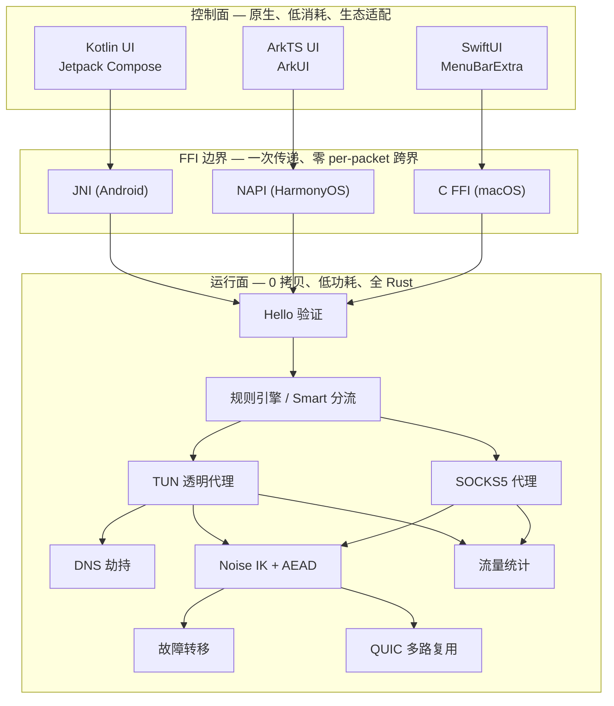
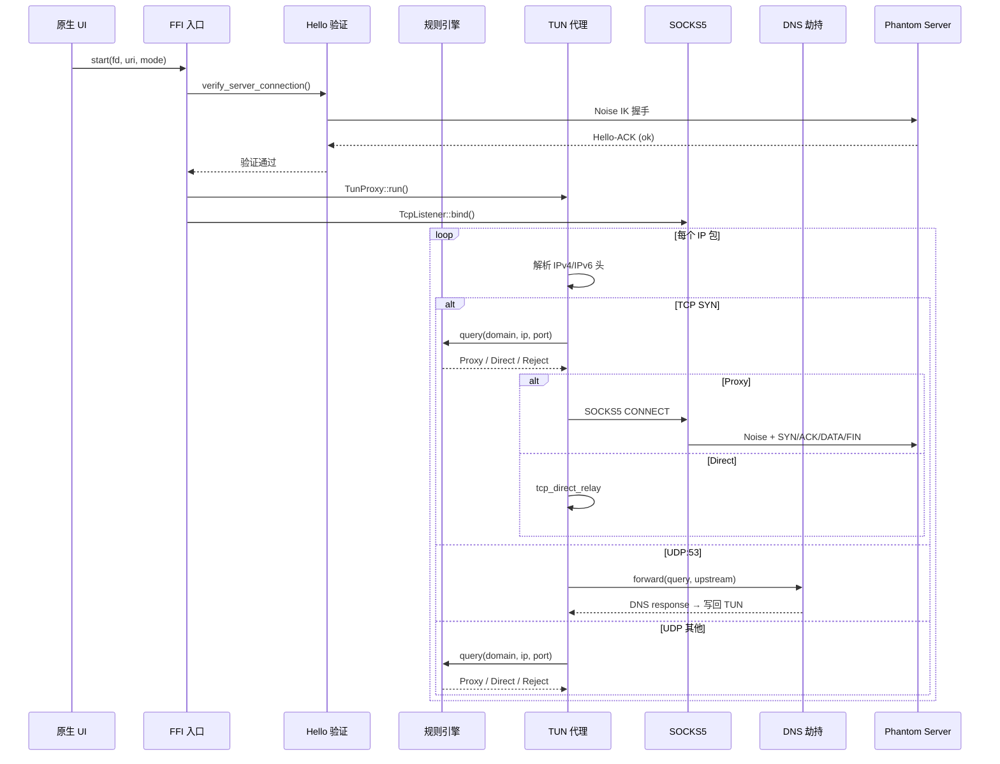
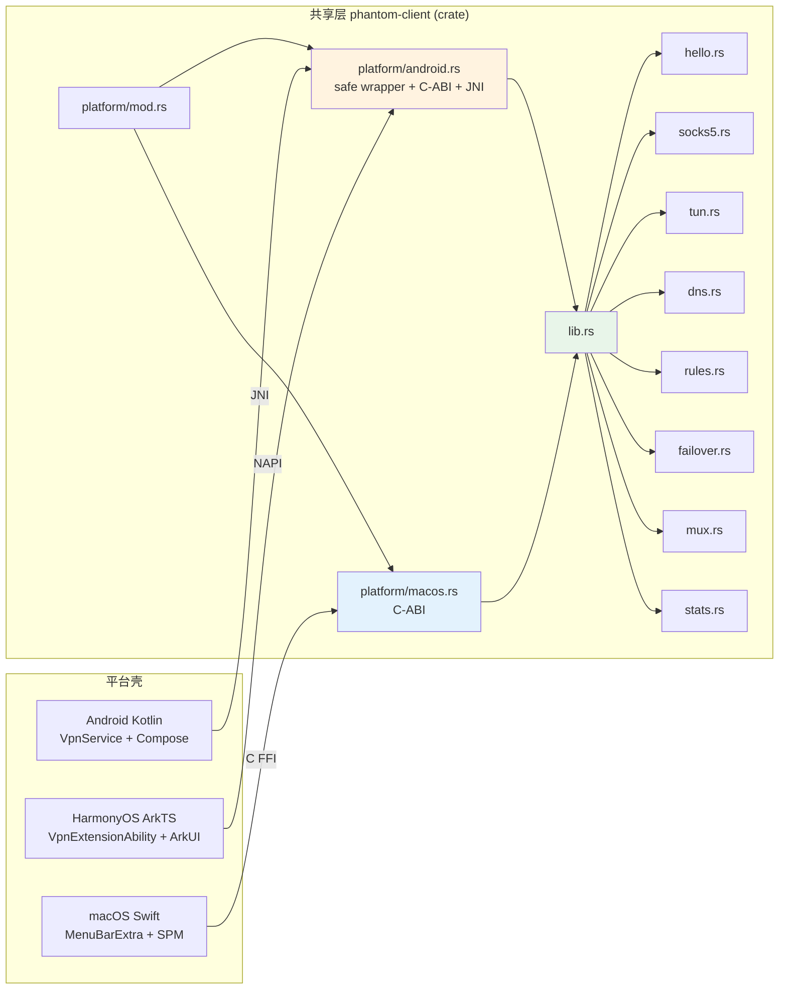

# Phantom Client

Phantom 客户端采用 **共享核心 + 平台壳** 分层架构：一个 Rust 共享层提供全部隧道能力，三个原生壳（Android / HarmonyOS / macOS）仅负责 UI 和平台 API 适配。

## PRD 功能 → 技术架构映射

| PRD 功能 | 技术模块 | 实现位置 | 关键技术点 |
|----------|----------|----------|------------|
| 加密隧道 | `phantom-core` crypto + transport | `core/src/crypto/`, `core/src/transport/` | Noise IK 握手、AES-GCM/ChaCha20-Poly1305/Ascon128 |
| 透明代理 | `tun.rs` | `client/src/tun.rs` | tun2socks-lite、零 per-packet JNI/NAPI |
| SOCKS5 代理 | `socks5.rs` | `client/src/socks5.rs` | 标准 SOCKS5 协议、连接级加密 |
| DNS 防污染 | `dns.rs` | `client/src/dns.rs` | UDP:53 拦截 → DoT/DoH 上游、DNS 缓存 |
| 智能分流 | `rules.rs` | `client/src/rules.rs` | AC 自动机 + LC-Trie + 域名后缀 Trie |
| 连接验证 | `hello.rs` | `client/src/hello.rs` | Hello/Hello-ACK 端到端探测 |
| 多服务器故障转移 | `failover.rs` | `client/src/failover.rs` | 原子指针轮转、TCP 健康探测 |
| QUIC 多路复用 | `mux.rs` | `client/src/mux.rs` | 首流 Noise 握手、后续流 HKDF 派生 |
| 流量统计 | `stats.rs` | `client/src/stats.rs` | 原子计数器、Prometheus 格式导出 |

## 技术架构：控制面与运行面



### 控制面设计原则

| 原则 | 实践 |
|------|------|
| **原生** | Android 用 Kotlin + Jetpack Compose；HarmonyOS 用 ArkTS + ArkUI；macOS 用 SwiftUI |
| **低消耗** | 控制面仅启动/停止/状态/日志 4 类操作，频率 ≤2Hz 轮询；所有数据面流量零跨界 |
| **生态适配** | Android: JNI `jni 0.21`；HarmonyOS: NAPI `napi-ohos 1.x`；macOS: C ABI cdylib |

### 运行面设计原则

| 原则 | 实践 |
|------|------|
| **0 拷贝 / 少拷贝** | TUN 读取用 `BytesMut` 池化复用；SOCKS5 relay 用 `read_buf` → `split().freeze()` |
| **低功耗** | `AsyncFd` epoll 边沿触发，无包时线程阻塞；DNS 缓存减少重复查询 |
| **全 Rust** | 所有加密、网络 I/O、包解析、NAT 在 Rust 内完成，原生层只做 UI |

## 运行面技术流程



## 共享层与平台壳的边界



**关键边界规则**：

| 规则 | 说明 |
|------|------|
| 平台壳不碰 Rust 数据结构 | Kotlin/ArkTS/Swift 只调 FFI 函数，不直接读写 Rust 内存 |
| TUN fd 一次传递 | VpnService / VpnExtensionAbility 创建 TUN → 传 fd 给 Rust → 之后所有包 I/O 在 Rust 内 |
| safe wrapper 隔离 unsafe | `platform/android.rs` 提供 `pub fn android_*` safe 函数，JNI/NAPI 调 safe wrapper，零 unsafe |
| macOS 自建 TUN | `TunDevice::create()` 在 Rust 内创建 utun 设备，无需 Kotlin/ArkTS 的 VpnService |
| HarmonyOS 复用 Android 核心 | `platform/android.rs` 的 safe wrapper 同时服务 JNI 和 NAPI |

## 技术模块详解

### hello.rs — 端到端连通验证

| 技术点 | 实现 |
|--------|------|
| 握手协议 | Noise IK → stream_id=0 → PH/HELLO → PH/HELLO_ACK |
| 探测目标 | 服务端访问 `captive.apple.com` / `detectportal.firefox.com` |
| 超时 | 可配（默认 10s），`tokio::time::timeout` |
| 阻塞行为 | 验证失败则隧道不启动，UI 显示 Error |

### tun.rs — TUN 透明代理 (tun2socks-lite)

| 技术点 | 实现 |
|--------|------|
| 设备创建 | macOS: `tun` crate 创建 utun；Android/ohos: `from_fd(fd)` 接收 VpnService fd |
| 包读取 | macOS: `AsyncDevice::read_buf`；Android/ohos: `libc::read` + `AsyncFd` |
| TCP 状态机 | `TcpFlowState` 跟踪 seq/ack，构造 SYN-ACK / PSH-ACK / FIN-ACK / RST |
| 流表 | `FlowTable` — `HashMap<FlowKey, FlowHandle>` + `Arc<Mutex>` |
| UDP 直接转发 | `UdpFlowTable` — 每流 `UdpSocket`，读写 TUN |
| UDP 隧道转发 | `UdpProxyFlowTable` — 通过 Phantom 帧中继 |
| 热重载 | `HotReloadState` — 5s 轮询配置文件 mtime，动态更新 proxy_mode / rules |
| 指标 | `TrafficStats` 原子计数器 + 127.0.0.1:9150 Prometheus HTTP |

### socks5.rs — 本地 SOCKS5 代理

| 技术点 | 实现 |
|--------|------|
| 协议 | RFC 1928：Method Negotiation → Request → Connect → Relay |
| 认证 | No Auth (0x00) |
| 地址类型 | IPv4 / IPv6 / Domain |
| 隧道建立 | `establish_tunnel()` → Noise IK + SYN/ACK → 双向 `try_join!` relay |
| 缓冲 | `BytesMut::with_capacity(MAX_FRAME_PAYLOAD)` + `read_buf` |

### dns.rs — DNS 防污染代理

| 技术点 | 实现 |
|--------|------|
| 拦截 | TUN 收到 UDP:53 包 → `DnsProxy::forward()` |
| 上游 | 可配 DoT (`tls://8.8.8.8:853`) / 普通 UDP |
| 缓存 | `DnsCache` — `HashMap<Ipv4Addr, String>` (A 记录反查域名) |
| 响应构建 | `etherparse::PacketBuilder` 构造 IPv4+UDP 包写回 TUN |

### rules.rs — 智能分流规则引擎

| 技术点 | 实现 |
|--------|------|
| DomainFull | `HashMap<String, RuleAction>` O(1) |
| DomainSuffix | 反转标签 Trie（`.google.com` → `com.google`） |
| DomainKeyword | `daachorse::DoubleArrayAhoCorasick` AC 自动机 |
| DomainRegex | `regex::RegexSet` 批量匹配 |
| IP-CIDR | `iptrie::LCTrieMap` 层压缩 Patricia Trie，最长前缀匹配 |
| Port | `HashMap<u16, RuleAction>` |
| GEOIP | `maxminddb` (feature gate `geoip`) |
| 优先级 | Domain > IP-CIDR > Port > GEOIP > Final |

### failover.rs — 多服务器故障转移

| 技术点 | 实现 |
|--------|------|
| 服务器选择 | `AtomicUsize` 原子指针轮转 |
| 健康探测 | TCP connect 探测，可配间隔/超时/阈值 |
| 状态机 | Healthy → Degraded (连续失败) → Down (超阈值) → 切换 |

### mux.rs — QUIC 多路复用

| 技术点 | 实现 |
|--------|------|
| 连接复用 | 单 QUIC 连接，首流 Noise IK 握手 |
| 密钥派生 | 后续流 HKDF 从连接密钥 + stream_id 派生 |
| 会话管理 | `MuxState` 枚举：HandshakePending / HandshakeDone |

### stats.rs — 流量统计

| 技术点 | 实现 |
|--------|------|
| 计数器 | `AtomicU64` 无锁 |
| 导出 | Prometheus exposition format via 127.0.0.1:9150 |
| 指标 | tcp_bytes_up/down, udp_bytes_up/down, tcp_connections, udp_datagrams |

## 使用的技术框架

| 领域 | 框架 / 库 | 版本 | 用途 |
|------|-----------|------|------|
| 异步运行时 | tokio | workspace | 全功能多线程 runtime |
| 加密 | phantom-core crypto | workspace | Noise IK + AES-GCM / ChaCha20-Poly1305 / Ascon128 |
| 传输 | phantom-core transport | workspace | TCP / QUIC (quinn) |
| 协议 | phantom-core protocol | workspace | Frame codec (SYN/ACK/DATA/FIN/RST/UDP) |
| TUN 设备 | `tun` (macOS) / `libc` (Android/ohos) | 0.7 / 0.2 | utun 创建 / fd 包装 |
| 包解析 | etherparse | 0.14 | IPv4/IPv6/TCP/UDP 头解析 + 构造 |
| 规则引擎 | daachorse / iptrie / regex | 1 / 0.8 / 1.10 | AC 自动机 / LC-Trie / 正则集 |
| 缓冲池 | bytes | workspace | `BytesMut` / `Bytes` 零拷贝 relay |
| 配置 | toml / serde | workspace | TOML 反序列化 |
| 日志 | tracing / tracing-subscriber | workspace | 结构化日志 + 环形缓冲 writer |
| Android JNI | jni | 0.21 | `JNIEnv<'local>` 现代 API |
| HarmonyOS NAPI | napi-ohos / napi-derive-ohos | 1 | `#[napi]` 宏生成 |
| GEOIP | maxminddb | 0.24 | GeoIP2 Country 查询 (feature gate) |

## 构建

### 统一构建系统（推荐）

项目使用 `cargo xtask` 作为统一构建编排器，自动检查依赖并构建：

```bash
# 构建所有可用目标
cargo xtask build

# 构建指定目标
cargo xtask build server          # 服务端
cargo xtask build cli             # CLI 客户端
cargo xtask build mac            # macOS 客户端
cargo xtask build android        # Android 客户端
cargo xtask build harmony        # HarmonyOS 客户端

# 其他命令
cargo xtask check-deps           # 检查依赖状态（自动安装可安装的）
cargo xtask icons                # 重新生成所有平台图标
cargo xtask clean                # 清理所有构建产物
```

### 依赖

- Rust toolchain >= 1.85, edition 2024
- macOS: Xcode Command Line Tools
- Android: NDK + `aarch64-linux-android` target
- HarmonyOS: DevEco Studio NEXT + `aarch64-unknown-linux-ohos` target

运行 `cargo xtask check-deps` 查看依赖状态，可自动安装 Rust targets。

### 构建 Rust 共享库

```bash
# macOS (默认)
cargo build --release -p phantom-client --lib

# Android ARM64
rustup target add aarch64-linux-android
export ANDROID_NDK_HOME=$HOME/Library/Android/sdk/ndk/26.1.10909125
cargo build --release -p phantom-client --lib --target aarch64-linux-android

# HarmonyOS
cargo build --release -p phantom-harmony --target aarch64-unknown-linux-ohos
```

### 一键脚本

```bash
scripts/build-mac.sh              # macOS
scripts/build-android.sh          # Android
scripts/build-harmony.sh          # HarmonyOS NEXT
```

## 测试

```bash
# 单元测试
cargo test -p phantom-client

# 全 workspace
cargo test --workspace

# Clippy
cargo clippy -p phantom-client

# 集成测试（需要服务端运行）
cargo test --workspace --test full_link_tcp
cargo test --workspace --test rule_engine
```

## 安装与部署

各平台的安装方式见对应子目录 README：

- **CLI 客户端**：`cargo xtask build cli` 或 `cargo build --release -p phantom-cli`，二进制 `target/release/phantom`
- [client/android/README.md](android/README.md) — APK 安装、Gradle 构建
- [client/harmony/README.md](harmony/README.md) — HAP 安装、HDC 部署
- [client/mac/README.md](mac/README.md) — .app / DMG 打包签名