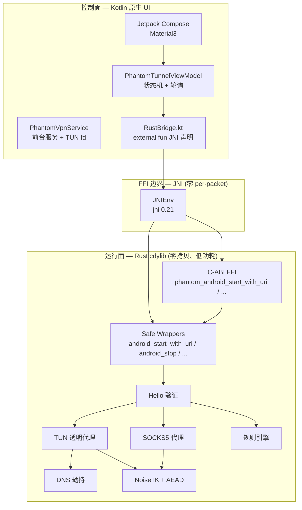
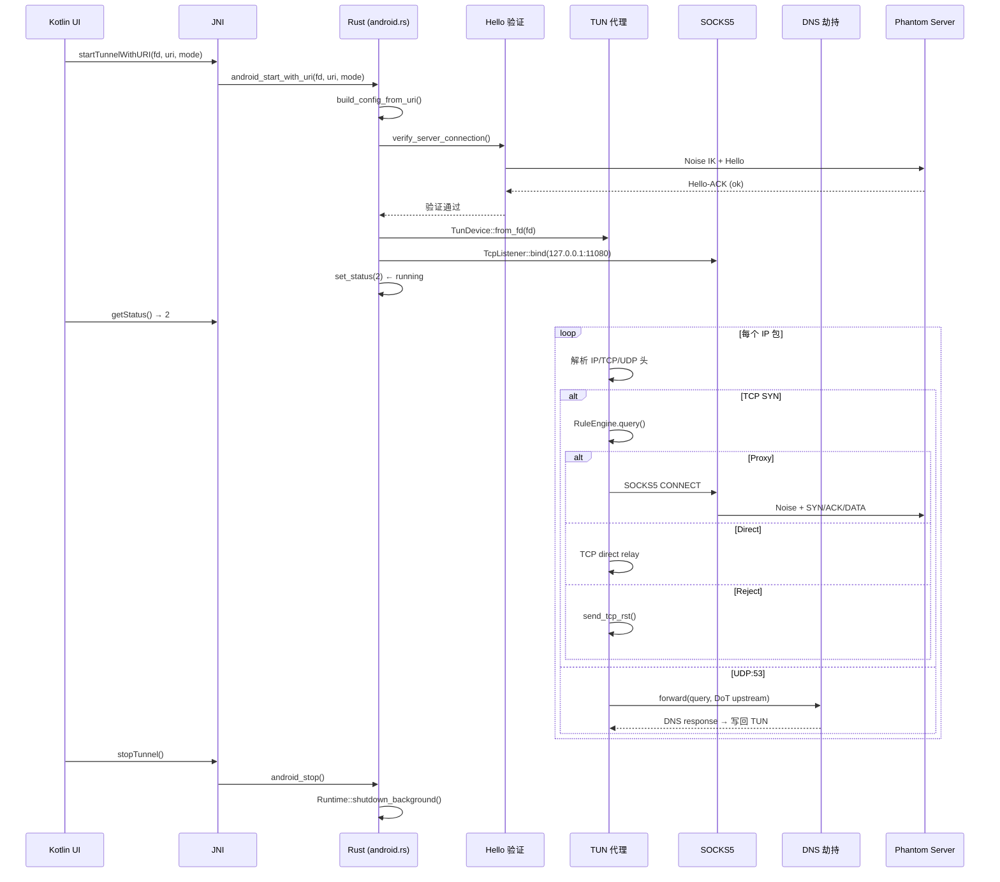
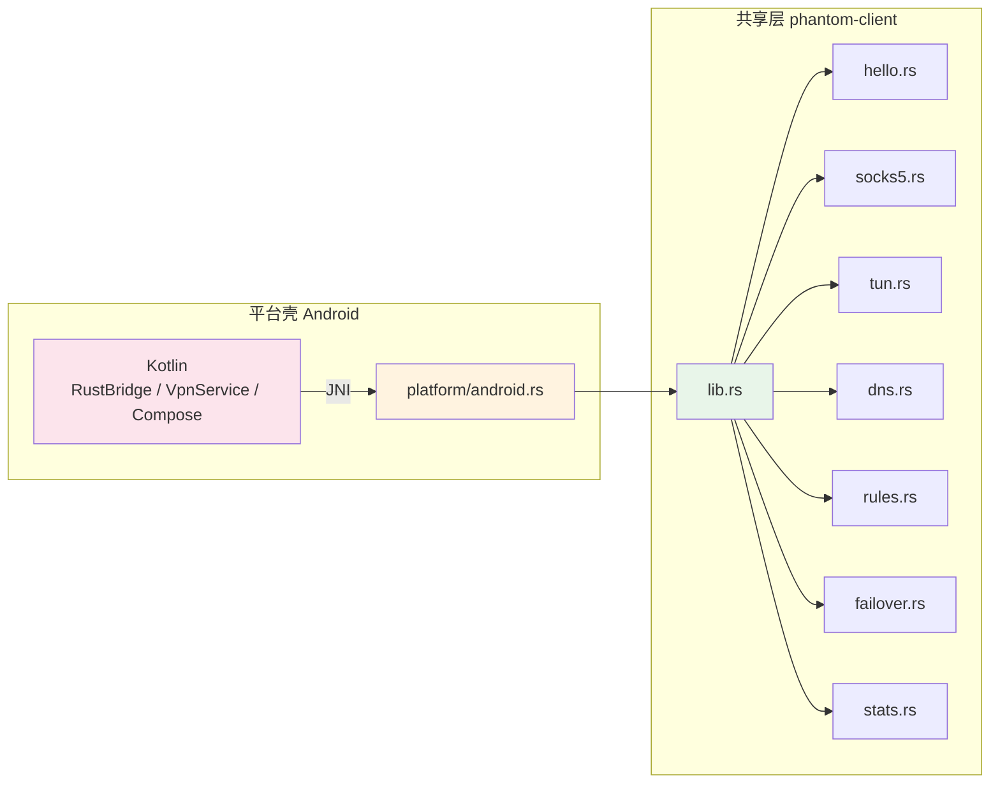

# Phantom Android Client

Native Android VPN 客户端。隧道引擎全部运行在 Rust cdylib 中，Kotlin 仅做 VpnService 壳 + UI。

## PRD 功能 → 技术架构映射

| PRD 功能 | 技术模块 | 实现位置 | 关键技术点 |
|----------|----------|----------|------------|
| VPN 隧道 | `platform/android.rs` | `client/src/platform/android.rs` | VpnService TUN fd 一次传递，零 per-packet JNI |
| URI 扫码配置 | `build_config_from_uri` | `client/src/platform/android.rs` | `phantom://` URI 解析 → ClientConfig |
| 智能分流 | `rules.rs` | `client/src/rules.rs` | Smart 模式：Domain/IP-CIDR/Port/GEOIP 规则引擎 |
| DNS 防污染 | `dns.rs` | `client/src/dns.rs` | UDP:53 拦截 → DoT 上游 |
| 连接验证 | `hello.rs` | `client/src/hello.rs` | Hello/Hello-ACK 端到端探测 |
| 故障转移 | `failover.rs` | `client/src/failover.rs` | 多服务器 TCP 健康探测 |
| 流量统计 | `stats.rs` | `client/src/stats.rs` | 原子计数器、Prometheus 导出 |

## 技术架构：控制面与运行面



### 控制面设计

| 方法 | 方向 | 频率 | 说明 |
|------|------|------|------|
| `startTunnelWithURI(fd, uri, mode)` | Kotlin → Rust | 单次 | 启动隧道 |
| `stopTunnel()` | Kotlin → Rust | 单次 | 停止隧道 |
| `getStatus()` | Kotlin ← Rust | 500ms | 0 idle / 1 starting / 2 running / 3 error |
| `getLastError()` | Kotlin ← Rust | 状态 3 时 | 错误信息 |
| `getLogs(since)` | Kotlin ← Rust | 1000ms | 批量日志 + cursor |

### 运行面设计（零 per-packet JNI）

| 技术点 | 实现 |
|--------|------|
| TUN fd 一次传递 | Kotlin `VpnService.Builder.establish()` → `detachFd()` → 传给 Rust `TunDevice::from_fd(fd)` |
| 包 I/O 全在 Rust | `libc::read` / `libc::write` + `AsyncFd` epoll，无 JNI 开销 |
| 0 拷贝 | `BytesMut` 池化，`read_buf` → `split().freeze()` |
| 低功耗 | `AsyncFd` 边沿触发，无包时线程阻塞 |
| DNS 缓存 | `DnsCache` 减少 DoT 重复查询 |
| 流量统计 | `AtomicU64` 无锁计数器 |

## 运行面技术流程



## 共享层与平台壳边界



**边界规则**：

| 规则 | 说明 |
|------|------|
| Kotlin 只调 `RustBridge` | `external fun` JNI 声明，不直接读写 Rust 内存 |
| TUN fd 一次传递 | `PhantomVpnService.detachFd()` → Rust `from_fd(fd)` → 之后零 JNI |
| safe wrapper 隔离 unsafe | JNI 调 `android_start_with_uri()` 等 safe 函数，C-ABI 委托给 safe wrapper |
| 状态查询无分配 | `getStatus()` 返回 `jint`，`getLastError()` 返回 `JString`，无手动 CString 释放 |

## 技术模块与实现位置

| 文件 | 职责 | 关键技术点 |
|------|------|------------|
| `MainActivity.kt` | Compose UI、VPN 权限回调 | `rememberLauncherForActivityResult` |
| `PhantomTunnelViewModel.kt` | 状态机 + 日志轮询 | `viewModelScope.launch` 500ms/1000ms |
| `PhantomVpnService.kt` | 前台服务 + TUN fd 传递 | `VpnService.Builder.establish().detachFd()` |
| `RustBridge.kt` | JNI 声明 | `external fun startTunnelWithURI(...)` |
| `platform/android.rs` | C-ABI + safe wrapper + 状态机 + 日志缓冲 | `AtomicI32` 状态、`Vec<String>` 环形缓冲 |
| `tun.rs` | TUN 透明代理 (tun2socks-lite) | `AsyncFd` + `libc::read/write` |
| `socks5.rs` | 本地 SOCKS5 代理 | RFC 1928、连接级加密 |
| `dns.rs` | DNS 劫持 | UDP:53 → DoT 上游、`DnsCache` |
| `rules.rs` | 规则引擎 (Smart 模式) | AC 自动机 + LC-Trie |
| `hello.rs` | Hello 验证 | Noise IK → PH/HELLO → PH/HELLO_ACK |

## 使用的框架

| 层 | 框架/库 | 版本 | 用途 |
|---|---------|------|------|
| UI | Jetpack Compose | — | Material3 界面 |
| ViewModel | Lifecycle ViewModel | — | 状态管理 |
| VPN | Android VpnService | — | 前台服务 + TUN fd |
| Rust-JNI | `jni` | 0.21 | 现代 `JNIEnv<'local>` API |
| Rust 异步 | tokio | workspace | 全功能 runtime |
| Rust TUN | `libc` + `AsyncFd` | 0.2.186 | fd 包装 + epoll |
| Rust 加密 | phantom-core crypto | workspace | Noise IK + AES-GCM / ChaCha20-Poly1305 / Ascon128 |

## 构建

### 统一构建系统（推荐）

```bash
# 从项目根目录
cargo xtask build android          # release 构建
cargo xtask build android --debug  # debug 构建
```

`cargo xtask` 会自动检查依赖（NDK、Rust target 等），调用 `scripts/build-android.sh` 脚本。

### 一键脚本

```bash
scripts/build-android.sh              # 默认 release
scripts/build-android.sh --debug      # debug 构建
ALL_TARGETS=1 scripts/build-android.sh  # 全 ABI
```

前置条件：
- Rust toolchain + Android targets：`rustup target add aarch64-linux-android`
- [`cargo-ndk`](https://github.com/bbqsrc/cargo-ndk)：`cargo install cargo-ndk`
- Android NDK：设置 `ANDROID_NDK_HOME`

脚本会：
1. `rustup target add aarch64-linux-android` — 安装 Android Rust target
2. `cargo build -p phantom-client --lib --target aarch64-linux-android` — 编译 Rust cdylib
3. 复制 `libphantom_client.so` → `jniLibs/arm64-v8a/`
4. 可选 Gradle APK 构建

### 构建产物

```
client/android/app/src/main/
├── jniLibs/                        # Rust cdylib（gitignore）
│   └── arm64-v8a/
│       └── libphantom_client.so
└── res/
    ├── drawable/                   # 自适应图标前景/背景
    │   ├── ic_launcher_foreground.png
    │   └── ic_launcher_background.xml
    └── mipmap/                     # 自适应图标配置
        ├── ic_launcher.xml
        └── ic_launcher_round.xml

client/android/app/build/outputs/   # APK 产物（gitignore）
└── apk/debug/app-debug.apk
```

### 手动构建

```bash
cd ../../
rustup target add aarch64-linux-android
export ANDROID_NDK_HOME=$HOME/Library/Android/sdk/ndk/26.1.10909125
CARGO_TARGET_AARCH64_LINUX_ANDROID_LINKER=$ANDROID_NDK_HOME/toolchains/llvm/prebuilt/darwin-x86_64/bin/aarch64-linux-android34-clang \
  cargo build --release -p phantom-client --lib --target aarch64-linux-android
cp target/aarch64-linux-android/release/libphantom_client.so \
   client/android/app/src/main/jniLibs/arm64-v8a/
```

### 重新生成图标

```bash
# 统一构建系统
cargo xtask icons              # 生成所有平台图标（含 Android 5 密度）
```

或手动使用 `sips` 从 `appicon.png` 生成自适应图标前景：

| 密度 | 尺寸 (px) | 目录 |
|------|-----------|------|
| mdpi | 108 | `drawable-mdpi/` |
| hdpi | 162 | `drawable-hdpi/` |
| xhdpi | 216 | `drawable-xhdpi/` |
| xxhdpi | 324 | `drawable-xxhdpi/` |
| xxxhdpi | 432 | `drawable-xxxhdpi/` |

### Gradle 构建

1. 打开 `client/android/` 在 Android Studio 中
2. Sync Gradle → Run on device

## 打包与签名

- **APK 打包**：Gradle `assembleRelease` / `assembleDebug`
- **签名**：Android Studio 自动 debug 签名；release 需配置 `signingConfigs`
- **Rust cdylib 打包**：`libphantom_client.so` 放入 `jniLibs/<abi>/`，Gradle 自动打包进 APK

## 测试

```bash
# Rust 单元测试
cargo test -p phantom-client

# Android Instrumented Test
./gradlew connectedAndroidTest

# 真机/模拟器
# Pixel / 小米 / 华为 Android 12-14
```

## 安装

```bash
# ADB 安装
adb install app/build/outputs/apk/debug/app-debug.apk

# Android Studio
# Run on device → 自动安装
```

## 部署

1. 构建 APK → 分发（应用商店 / 侧载）
2. 用户安装 → 扫描 `phantom://` URI 或手动输入 → 点击 Start
3. VPN 权限授权 → `PhantomVpnService` 创建 TUN → Rust 接管

## TODO

- [ ] 真机/模拟器验证（Pixel / 小米 / 华为 Android 12-14）
- [ ] Instrumented tests（`RustBridgeInstrumentedTest.kt`）
- [ ] 多 ABI 构建（arm64-v8a + armeabi-v7a + x86_64）
- [ ] CI 自动化（`mobile.yml`：cargo-ndk + AVD + connectedAndroidTest）
- [ ] 后台保活 / 锁屏 / 飞行模式切换测试