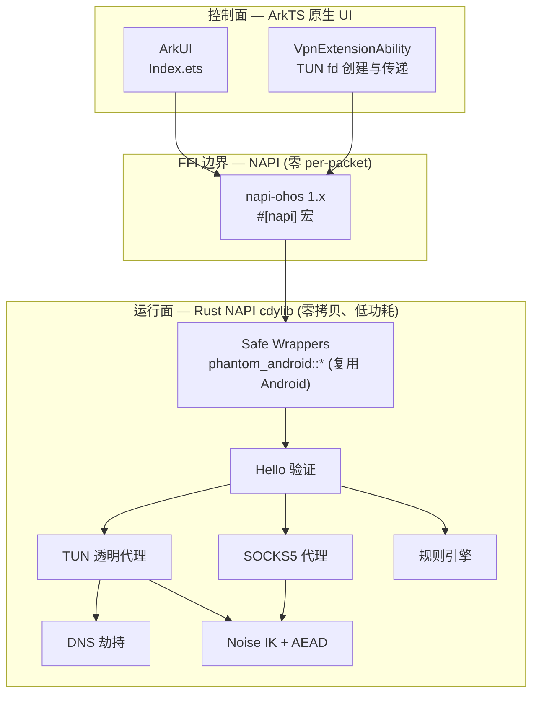
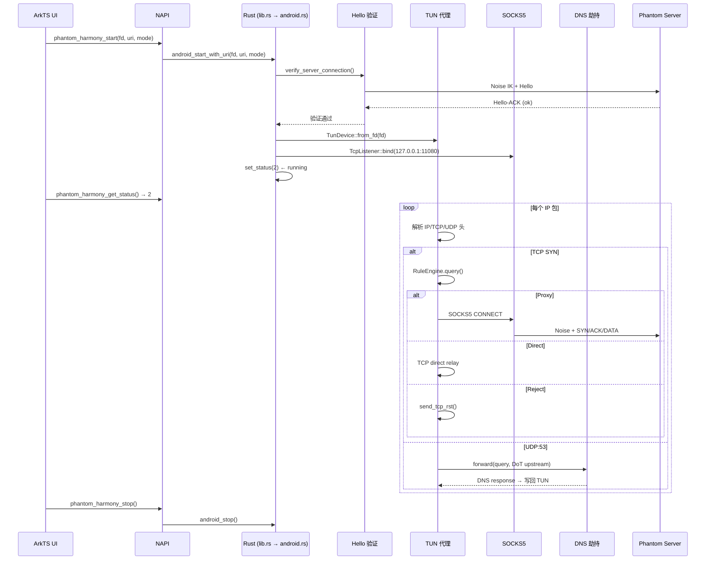
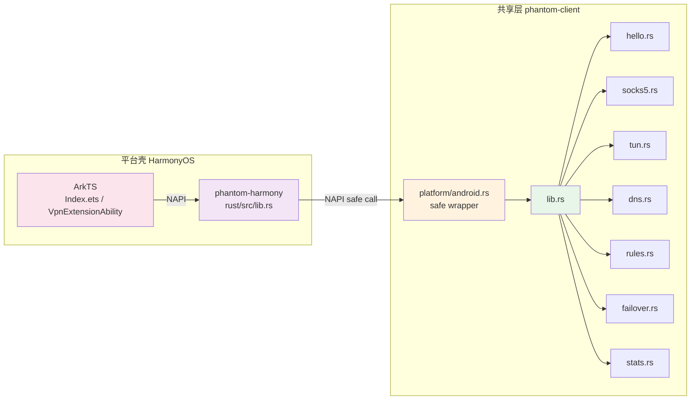

# Phantom HarmonyOS NEXT Client

HarmonyOS NEXT (API 12+) 原生 VPN 客户端。隧道引擎全部运行在 Rust NAPI 模块中，ArkUI 仅做配置与状态显示。

## PRD 功能 → 技术架构映射

| PRD 功能 | 技术模块 | 实现位置 | 关键技术点 |
|----------|----------|----------|------------|
| VPN 隧道 | `platform/android.rs` safe wrapper | `client/src/platform/android.rs` | HarmonyOS 复用 Android safe wrapper，零 unsafe |
| URI 扫码配置 | `android_start_with_uri` | `client/src/platform/android.rs` | `phantom://` URI 解析 → ClientConfig |
| NAPI 桥接 | `rust/src/lib.rs` | `client/harmony/rust/src/lib.rs` | `#[napi]` 宏生成，全部 safe Rust |
| 智能分流 | `rules.rs` | `client/src/rules.rs` | Smart 模式规则引擎 |
| DNS 防污染 | `dns.rs` | `client/src/dns.rs` | UDP:53 拦截 → DoT 上游 |
| 连接验证 | `hello.rs` | `client/src/hello.rs` | Hello/Hello-ACK 端到端探测 |
| 故障转移 | `failover.rs` | `client/src/failover.rs` | 多服务器 TCP 健康探测 |

## 技术架构：控制面与运行面



### 控制面设计

| 方法 | 方向 | 频率 | 说明 |
|------|------|------|------|
| `phantom_harmony_start(fd, uri, mode)` | ArkTS → Rust | 单次 | 启动隧道 |
| `phantom_harmony_stop()` | ArkTS → Rust | 单次 | 停止隧道 |
| `phantom_harmony_get_status()` | ArkTS ← Rust | 500ms | 0 idle / 1 starting / 2 running / 3 error |
| `phantom_harmony_get_last_error()` | ArkTS ← Rust | 状态 3 时 | 错误信息 |
| `phantom_harmony_get_logs(since)` | ArkTS ← Rust | 1000ms | 批量日志 + cursor |

### 运行面设计（零 per-packet NAPI）

| 技术点 | 实现 |
|--------|------|
| TUN fd 一次传递 | `VpnExtensionAbility` 创建 TUN → 传 fd 给 Rust `TunDevice::from_fd(fd)` |
| 包 I/O 全在 Rust | `libc::read` / `libc::write` + `AsyncFd` epoll，无 NAPI 开销 |
| 0 拷贝 | `BytesMut` 池化，`read_buf` → `split().freeze()` |
| 低功耗 | `AsyncFd` 边沿触发，无包时线程阻塞 |
| DNS 缓存 | `DnsCache` 减少 DoT 重复查询 |

## 运行面技术流程



## 共享层与平台壳边界



**关键：HarmonyOS 复用 Android 共享核心**

| 规则 | 说明 |
|------|------|
| NAPI 零 unsafe | `lib.rs` 全部 `#[napi]` 函数调 `phantom_android::android_*` safe wrapper |
| 复用 Android 状态机 | `AtomicI32` 状态、环形日志缓冲、`LAST_ERROR` 全在 `android.rs` |
| TUN fd 同样一次传递 | `VpnExtensionAbility` 创建 TUN → 传 fd → Rust 接管 |
| 独立 cdylib | `phantom-harmony` 编译为独立 `libphantom_harmony.so` |

## 技术模块与实现位置

| 文件 | 职责 | 关键技术点 |
|------|------|------------|
| `entry/src/main/ets/pages/Index.ets` | ArkUI 主界面 | URI 输入、状态显示、日志显示 |
| `entry/src/main/ets/entryability/EntryAbility.ets` | 应用入口 | 生命周期管理 |
| `entry/src/main/ets/vpnextability/PhantomVpnExtensionAbility.ets` | VPN 扩展能力 | TUN fd 创建与传递 |
| `rust/src/lib.rs` | NAPI 桥接 | 全部 safe Rust，`#[napi]` 宏 |
| `platform/android.rs` | safe wrapper + 状态机 | HarmonyOS 复用 |
| `tun.rs` | TUN 透明代理 | `AsyncFd` + `libc::read/write` |
| `socks5.rs` | 本地 SOCKS5 代理 | 连接级加密 |
| `dns.rs` | DNS 劫持 | DoT 上游 |
| `rules.rs` | 规则引擎 | Smart 模式 |
| `hello.rs` | Hello 验证 | 端到端探测 |

## 使用的框架

| 层 | 框架/库 | 版本 | 用途 |
|---|---------|------|------|
| UI | ArkUI | HarmonyOS NEXT | 原生 UI 框架 |
| VPN | VpnExtensionAbility | API 12+ | VPN 扩展能力 |
| NAPI | `napi-ohos` + `napi-derive-ohos` | 1.x | Rust↔ArkTS 桥接 |
| Rust 异步 | tokio | workspace | 全功能 runtime |
| Rust TUN | `libc` + `AsyncFd` | 0.2.186 | fd 包装 + epoll |
| Rust 加密 | phantom-core crypto | workspace | Noise IK + AES-GCM / ChaCha20-Poly1305 / Ascon128 |

## 构建

### 统一构建系统（推荐）

```bash
# 从项目根目录
cargo xtask build harmony          # release 构建
cargo xtask build harmony --debug  # debug 构建
```

`cargo xtask` 会自动检查依赖（ohos target、DevEco SDK 等），调用 `scripts/build-harmony.sh` 脚本。

### 一键脚本

```bash
scripts/build-harmony.sh           # 默认 release
BUILD_MODE=debug scripts/build-harmony.sh  # debug 构建
```

前置条件：
- DevEco Studio NEXT（5.0+）+ HarmonyOS SDK API 12
- Rust target：`rustup target add aarch64-unknown-linux-ohos`
- `.cargo/config.toml` 中已配置 OHOS clang linker

脚本会：
1. `cargo build -p phantom-harmony --target aarch64-unknown-linux-ohos` — 编译 Rust NAPI cdylib
2. 复制 `libphantom_harmony.so` → `entry/src/main/resources/rawfile/libphantom.so`

### 构建产物

```
client/harmony/entry/src/main/
├── libs/arm64-v8a/                  # Rust NAPI cdylib（真机构建）
│   └── libphantom_harmony.so
└── resources/rawfile/               # Rust NAPI cdylib（模拟器构建）
    └── libphantom.so

client/harmony/build/outputs/        # APP/HAP 产物（gitignore）
└── default/
    ├── harmony-default-unsigned.app
    └── harmony-default-signed.app
```

### DevEco Studio 构建

1. 用 DevEco Studio 打开 `client/harmony`
2. 编译 Rust NAPI：`scripts/build-harmony.sh` 或 `cargo xtask build harmony`
3. 选择模拟器或真机 → Run

### 手动构建 Rust NAPI

```bash
cd client/harmony/rust
cargo build --target aarch64-unknown-linux-ohos --release
# 真机：复制到 libs/
mkdir -p ../entry/src/main/libs/arm64-v8a/
cp ../../target/aarch64-unknown-linux-ohos/release/libphantom_harmony.so \
   ../entry/src/main/libs/arm64-v8a/
```

## 打包与签名

### 构建签名 APP（真机安装）

由于 hvigor 的 `signingConfigs` 要求加密密码（32+ 字符），当前采用 **无签名构建 + 手动签名** 的方式：

```bash
# 1. 编译 Rust NAPI .so
cargo build -p phantom-harmony --release --target aarch64-unknown-linux-ohos
mkdir -p entry/src/main/libs/arm64-v8a/
cp ../../target/aarch64-unknown-linux-ohos/release/libphantom_harmony.so \
   entry/src/main/libs/arm64-v8a/

# 2. ohpm 安装依赖
cd client/harmony && ohpm install

# 3. hvigor 无签名构建 APP
export DEVECO_SDK_HOME=/Applications/DevEco-Studio.app/Contents/sdk
./hvigorw --mode project -p product=default assembleApp

# 4. 手动签名（使用 OpenHarmony 调试证书）
java -jar <hap-sign-tool.jar> sign-app \
  -keyAlias "openharmony application release" \
  -keyPwd 123456 \
  -keystoreFile signing/OpenHarmony.p12 \
  -keystorePwd 123456 \
  -appCertFile signing/OpenHarmonyAppCertChain.cer \
  -profileFile signing/OpenHarmonyDebug.p7b \
  -inFile build/outputs/default/harmony-default-unsigned.app \
  -outFile build/outputs/default/harmony-default-signed.app \
  -signAlg SHA256withECDSA \
  -mode localSign
```

> **注意**：签名证书和密钥文件位于 `signing/` 目录（已 gitignore），`hap-sign-tool.jar` 位于 DevEco Studio SDK 目录中。

### HAP 打包（模拟器）

- DevEco Studio Build → Build Hap(s)/APP(s)
- 签名配置在 `build-profile.json5` 中
- `libphantom_harmony.so` 放入 `rawfile/`，DevEco 自动打包

## 测试

```bash
# Rust 单元测试
cargo test -p phantom-client

# DevEco Studio
# Run Tests on Device
```

## 安装与部署

### HDC 命令行（真机）

```bash
# 安装签名 APP
hdc install client/harmony/build/outputs/default/harmony-default-signed.app

# 卸载
hdc uninstall com.phantom.harmony

# 启动应用
hdc shell am start -a ohos.want.action.home -b com.phantom.harmony -m EntryAbility

# 查看日志
hdc hilog | grep -i phantom
```

### HDC 命令行（模拟器）

```bash
# 查看可用 AVD
/Applications/DevEco-Studio.app/Contents/tools/emulator/emulator -list-avds

# 启动模拟器
/Applications/DevEco-Studio.app/Contents/tools/emulator/emulator -avd <avd_name>

# 安装 HAP
hdc app install entry/build/default/outputs/default/entry-default-signed.hap

# 启动应用
hdc shell am start -a ohos.want.action.home -b com.phantom.harmony -m EntryAbility

# 查看日志
hdc hilog | grep -i phantom
```

### DevEco Studio

1. 打开项目 → 选择设备 → Run
2. 自动安装 + 启动

## 项目目录结构

```
client/harmony/
├── AppScope/                        # 应用级资源
│   ├── app.json5                    # 应用配置
│   └── resources/base/media/        # 应用图标
│       └── app_icon.png
├── entry/                           # 主模块
│   ├── src/main/
│   │   ├── ets/                     # ArkTS 源码
│   │   │   ├── pages/Index.ets      # 主界面
│   │   │   ├── entryability/        # 应用入口
│   │   │   └── vpnextability/       # VPN 扩展能力
│   │   ├── libs/arm64-v8a/          # Rust NAPI .so（真机，gitignore）
│   │   │   └── libphantom_harmony.so
│   │   └── resources/               # 资源文件
│   │       ├── base/media/          # 图标
│   │       └── rawfile/             # NAPI .so（模拟器，gitignore）
│   ├── build-profile.json5         # 模块构建配置
│   └── oh-package.json5             # 模块依赖
├── rust/                            # Rust NAPI 源码
│   └── src/lib.rs                   # #[napi] 宏桥接
├── signing/                         # 签名证书（gitignore）
├── build-profile.json5              # 项目构建配置
├── oh-package.json5                 # 项目依赖
├── hvigor/                          # hvigor 构建配置
└── Cargo.toml                       # Rust crate 配置
```

## TODO

- [ ] VpnExtensionAbility TUN 创建与 fd 传递实现
- [ ] 将签名流程集成到 cargo xtask build harmony
- [ ] 电量测试（长时间运行功耗数据采集）
- [ ] NAPI 事件通道优化（替代轮询）
- [ ] CI 自动化构建