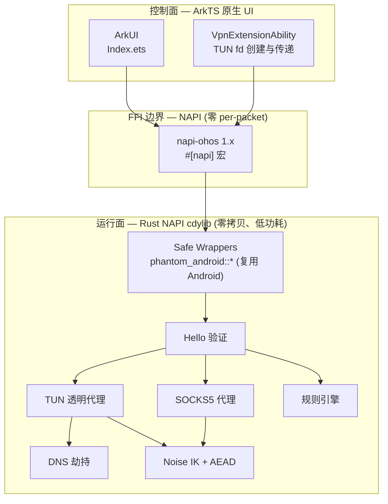
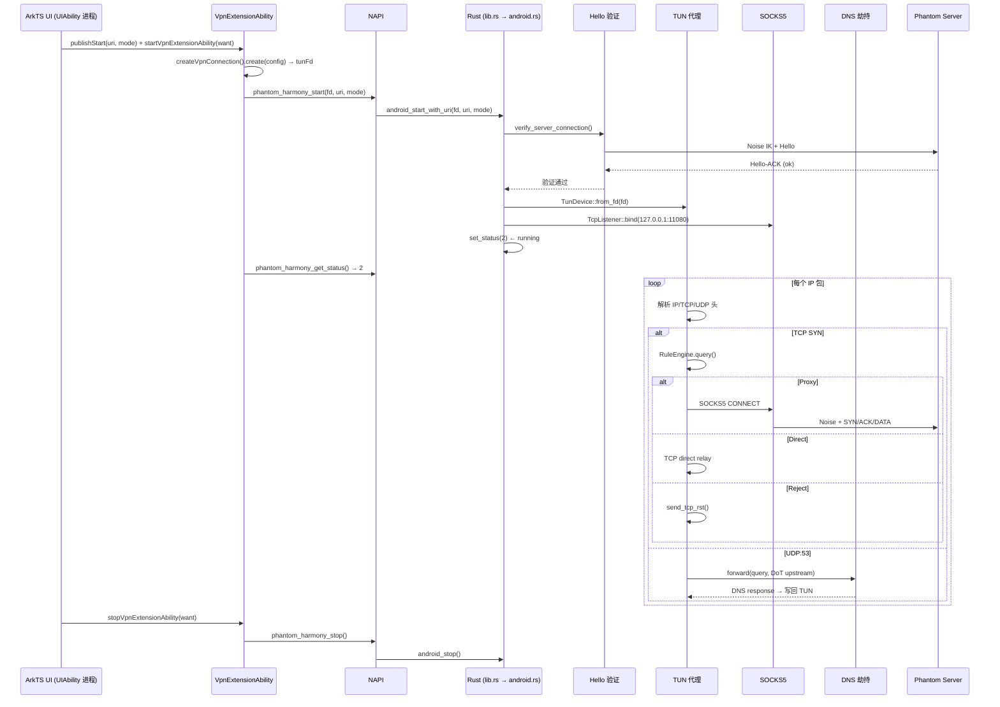
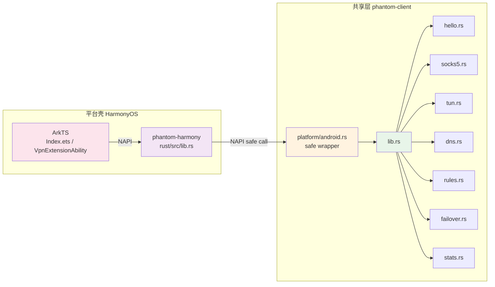

# Phantom HarmonyOS NEXT Client

HarmonyOS NEXT (API 12+) 原生 VPN 客户端。隧道引擎全部运行在 Rust NAPI 模块中，ArkUI 仅做配置与状态显示。

## PRD 功能 → 技术架构映射

| PRD 功能 | 技术模块 | 实现位置 | 关键技术点 |
|----------|----------|----------|------------|
| VPN 隧道 | `platform/android.rs` safe wrapper | `client/src/platform/android.rs` | HarmonyOS 复用 Android safe wrapper，零 unsafe |
| URI 扫码配置 | `android_start_with_uri` | `client/src/platform/android.rs` | `phantom://` URI 解析 → ClientConfig |
| NAPI 桥接 | `rust/src/lib.rs` | `client/harmony/rust/src/lib.rs` | `#[napi]` 宏生成，全部 safe Rust |
| 智能分流 | `rules.rs` | `client/src/rules.rs` | Smart 模式规则引擎 |
| DNS 防污染 | `dns.rs` | `client/src/dns.rs` | UDP:53 拦截 → DoT 上游 |
| 连接验证 | `hello.rs` | `client/src/hello.rs` | Hello/Hello-ACK 端到端探测 |
| 故障转移 | `failover.rs` | `client/src/failover.rs` | 多服务器 TCP 健康探测 |

## 技术架构：控制面与运行面


```mermaid
graph TB
    subgraph "控制面 — ArkTS 原生 UI"
        ArkUI["ArkUI<br/>Index.ets"]
        VPNExt["VpnExtensionAbility<br/>TUN fd 创建与传递"]
    end

    subgraph "FFI 边界 — NAPI (零 per-packet)"
        NAPI["napi-ohos 1.x<br/>#[napi] 宏"]
    end

    subgraph "运行面 — Rust NAPI cdylib (零拷贝、低功耗)"
        SafeWrapper["Safe Wrappers<br/>phantom_android::* (复用 Android)"]
        Hello["Hello 验证"]
        TUN["TUN 透明代理"]
        S5["SOCKS5 代理"]
        DNS["DNS 劫持"]
        Rules["规则引擎"]
        Crypto["Noise IK + AEAD"]
    end

    ArkUI --> NAPI
    VPNExt --> NAPI
    NAPI --> SafeWrapper
    SafeWrapper --> Hello
    Hello --> Rules & TUN & S5
    TUN --> DNS & Crypto
    S5 --> Crypto
```

### 控制面设计

| 方法 | 方向 | 频率 | 说明 |
|------|------|------|------|
| `phantom_harmony_start(fd, uri, mode)` | ArkTS → Rust | 单次 | 启动隧道 |
| `phantom_harmony_stop()` | ArkTS → Rust | 单次 | 停止隧道 |
| `phantom_harmony_get_status()` | ArkTS ← Rust | 500ms | 0 idle / 1 starting / 2 running / 3 error |
| `phantom_harmony_get_last_error()` | ArkTS ← Rust | 状态 3 时 | 错误信息 |
| `phantom_harmony_get_logs(since)` | ArkTS ← Rust | 1000ms | 批量日志 + cursor |

### VPN 能力接入（HarmonyOS 6.0 / 7.0）

系统「钥匙」图标与「允许使用 VPN」授权弹窗只由 **VpnExtensionAbility** 触发。
普通 UIAbility 里直接建连（例如只开一个本地 SOCKS5 端口）不会注册到系统 VPN
框架，因此既没有授权弹窗，也没有状态栏图标。两代系统的模型一致：

| 步骤 | API | 起始版本 | 说明 |
|------|-----|----------|------|
| 1. 声明扩展 | `module.json5` → `extensionAbilities[type=vpn]` | API 11 | 安装后 `bm dump` 里 `type=502` |
| 2. 请求启动 | `vpnExtension.startVpnExtensionAbility(want)` | API 11 | **系统在此弹出授权框**，用户同意后才真正拉起扩展进程 |
| 3. 建 vNIC | `createVpnConnection(context).create(config)` | API 11 | 返回 TUN fd；成功后状态栏出现 VPN 图标 |
| 4. 保护自身 socket | `protectProcessNet()` / `protect(fd)` | 22 / 11 | 隧道流量走物理网卡，不回灌 TUN |
| 5. 停止 | `stopVpnExtensionAbility(want)` 或 `destroy()` | 11 | 扩展 `onDestroy` 中销毁 vNIC，图标消失 |

HarmonyOS 7.0（API 26）额外提供 `vpnExtension.createVpnObserver()` +
`onAuthorizationResult(cb)`，可以拿到用户"允许/拒绝"的回调；6.0（API 20）没有，
只能通过扩展进程是否成功 `create()` 来推断。另外 6.0 起支持
`RouteInfo.isExcludedRoute`（服务器 IP 排除在隧道外）和 `generateVpnId()`
（多 VPN 共存），7.0 起 `create()` 的 fd 语义不变，`Want.parameters` 可在首次
启动时携带参数（22+）。

Phantom 的实现分工：

```
UIAbility 进程 (pages/Index.ets)          VpnExtensionAbility 进程
────────────────────────────────          ─────────────────────────────
publishStart(filesDir, uri, mode)  ──▶    onCreate → readStart() → create(vNIC)
startVpnExtensionAbility(want)            → phantomHarmonyStart(tunFd, uri, mode)
                                          → publishStatus()/appendLog()  ──▶ 
readStatus()/readLog()             ◀──    （1 Hz 把 Rust 状态写成文件）
```

两个进程不共享内存（`preferences` 的内存缓存也各自独立），所以状态与日志通过
`filesDir` 下的普通文件交换，见 `ets/common/VpnBridge.ets`：

| 文件 | 写入方 | 内容 |
|------|--------|------|
| `phantom_vpn_start.txt` | UI | `mode\nuri` |
| `phantom_vpn_status.txt` | 扩展 | `status\nupdatedAt\nerror` |
| `phantom_vpn.log` | 扩展 | Rust 日志（磁盘保留最后 400 行） |

### TUN 数据面

**TCP 终结**：TUN 里的应用把客户端当作对端，所以 `tun.rs` 必须实现一个够用的
TCP 发送方。当前实现要点（此前这里是大坑：序列号恒定、从不看 ACK，导致任何大于
一个 MSS 的响应都被对端当成重复而丢弃，TLS 握手必然失败）：

| 维度 | 实现 |
|------|------|
| 序号 | 每个流维护 `SND.UNA / SND.NXT / RCV.NXT`，SYN、数据、FIN 各自占用序号 |
| 分段 | 按 `TCP_MSS = 1400` 切分后写入 TUN |
| ACK | 解析应用回包的 ACK 与窗口，滑动 `send_queue`，窗口不足时暂停读取隧道 |
| 重传 | 500 ms 的 go-back-N 监管任务：`SND.NXT := SND.UNA` 后重发，20 次后放弃 |
| 去重 | 应用重传的重叠数据按 `RCV.NXT` 裁剪，避免重复注入隧道 |
| 背压 | 未确认队列超过 512 KiB 时停止从隧道读取，ACK 释放后经 `Notify` 唤醒 |

**代理直通**：TUN 决定走隧道后，会以内部 `ATYP_PREROUTED`（仅接受 loopback 来源）
向本地 SOCKS5 入口发起请求，明确表示"策略已判定"，避免 relay 用只剩 IP 的目标
再判一次而回退成直连。

### DNS 分流（TUN 模式）

应用的所有 DNS 查询都会进入 TUN，由客户端按域名分流决定用哪个解析器：

| 场景 | 解析器 | 传输 |
|------|--------|------|
| Smart 模式命中白名单（被墙域名） | `client.dns`（默认 `8.8.8.8:53`） | 经 `udp_relay` 在隧道内解析，服务端出口在 HK，无污染 |
| Smart 模式未命中（国内域名） | `client.dns_direct`（默认 `223.5.5.5:53`） | 物理网卡直连解析，CDN 节点最优 |
| Proxy 模式 | `client.dns` | 全部经隧道 |
| Direct 模式 | `client.dns_direct` | 全部本地 |

两个关键实现点：

- 解析出的 A 记录会写入 `DnsCache`（IP → 域名），TUN 的 TCP 路径据此命中白名单，
  所以「域名走隧道解析 → TCP 走隧道」是一条闭环链路。
- 直接解析用的 socket 属于被 `protectProcessNet()` 保护的扩展进程，并且
  它的源端口在 `handle_udp` 中被排除在劫持之外；扩展还会把直连解析器地址
  作为 `isExcludedRoute` 加入VPN 路由，保证 6.0（无 protectProcessNet）也不回环。

### 日志与扫码

- 日志：Rust 侧关闭 ANSI（`with_ansi(false)`）、target 前缀与时间戳，由 ArkTS
  统一加上本地 `HH:MM:SS`；UI 每行不换行（单行 + 省略号），只渲染最后
  **200 行**（`LOG_UI_LINES`），并提供「暂停 / 显示直连 / 清空」。
- 日志过滤默认是「仅隧道」：`route … -> Direct (…)` 与
  `route <域名>:53 -> Direct (dns local)` 都带 `-> Direct (`，所以一个开关就能
  同时滤掉国内 DNS 与国内直连两类噪音；切到「全部」才看明细。
- 连续重复的同一行（同一域名反复解析、同一目标反复重连）在界面上合并为一行并
  追加 `×N`，避免 200 行窗口被刷空；磁盘文件保持原始逐行记录。
- 磁盘日志是**滚动**的：默认保留最后 **2000 行**（`LOG_MAX_LINES`），不会无限堆积，
  排查问题时即使界面上隐藏了直连流量，文件里仍然完整。
- `route … -> PROXY|DIRECT`、`dns … via tunnel|local` 均为 INFO 级，便于直接核对分流。
- 「记录 TUN 追踪」开关（详情面板，默认关，**重启隧道后生效**）会把用户态 TCP 栈的
  报文级细节写到 `<filesDir>/phantom_tun_trace.log`（上限 5000 行）：对端 SYN 选项
  （MSS / wscale / SACK / TS）、我们发出的 SYN-ACK、每个注入分段的
  seq/len/窗口、零窗口探测、3 次重复 ACK 快速重传、流结束原因与上下行字节数。
  排查「某个 App 连不上」时先开它，再 `hdc file recv` 取回文件。追踪**不进入**界面日志。
- 扫码：`pages/ScanPage.ets` 自绘取景框（CameraKit 预览 → `ImageReceiver` 逐帧），
  每 350 ms 把一帧交给 HMS Scan Kit（`detectBarcode.decode({uri})`，失败时退化为
  `decodeImage` + NV21），识别到 `phantom://` 即写入 `phantom_ui` preferences 并返回。
  需要 `ohos.permission.CAMERA`；拒绝授权或识别失败时可从相册选择或手动粘贴。
- 扫码页跟随重力：订阅 `display.on('change')`，用
  `previewOutput.getPreviewRotation(displayRotation)` / `setPreviewRotation()` 让硬件预览
  在 0/90/180/270 四个方向都正立；软件回退路径同步 `pixelMap.rotate()`。
  进入扫码页时开启沉浸式全屏（`setWindowLayoutFullScreen` + 清空系统栏）并在退出时恢复，
  根容器带 `expandSafeArea`，因此上下不再有黑边。

### 直连失败回退到隧道

分流判断依赖 `DnsCache`（IP → 域名）。如果一个 App 自己解析域名（内置 DoH、或使用上次
会话缓存下来的 IP），我们看不到那条 DNS 查询，白名单就无法命中——Google Earth / Google
Maps 正是这种形态：它们直接用自己解析出来的 Google IP 建连。

这类连接只满足「没有任何规则命中、按 `final_action = direct` 放行」，是一个**猜测**。
因此这类直连如果在 2.5 s 内连不上（被墙的地址是被黑洞丢弃，而不是 refuse），
`tcp_direct_relay_task` 会把**同一条流**交给隧道重新中继：App 侧的 TCP 状态、序列号、
已缓冲的 payload 全部沿用，App 完全感知不到换过上游。日志会出现：

```
route 142.250.197.238:443 -> Proxy (direct connect timed out; retrying through the tunnel)
```

约束：只有 `RouteReason::Final` 的 Direct 才允许回退——`mode = direct` 是用户的明确指令，
用户规则里的 Direct 也不允许被改写（见 `RouteDecision::allows_tunnel_fallback` 与其单测）。

### 网络切换自愈

Wi-Fi ⇄ 移动数据切换会让隧道里所有 socket 失效（源地址变了），旧版本表现为「界面显示已连接
但什么都不通」。现在：

- `PhantomVpnExtensionAbility` 通过 `connection.createNetConnection()` 订阅
  `netAvailable` / `netLost` / `netCapabilitiesChange`，1 s 去抖后重新
  `protectProcessNet()` 并调用 NAPI `phantomHarmonyOnNetworkChange()`。
- Rust 侧 `android_notify_network_change()` 递增网络 epoch：epoch 过期的 TCP 流会被**立即
  RST**（让 App 尽快重连，而不是等自己的超时）、共享的 DNS-over-tunnel 流被丢弃（下次查询
  自动重建）、QUIC 池清空、failover 健康计数清零。
- 隧道 socket 开 TCP keepalive（15 s 空闲 + 3 次探测），避免「假连接」长期存在。
- 扩展进程被杀时，UI 按 3 s / 10 s / 30 s 退避自动重启，最多 3 次，之后提示手动重连；
  切换发生时界面顶部显示「网络已切换，正在自动重建隧道」。

### 首页信息架构

自上而下：标题 → 服务器卡片（**地址**、状态徽标、协议与加密、实时速率与分流统计，整卡
可点开详情）→ 主按钮（启动/停止 + 一行提示）→ 模式段控件（全局/智能/直连）→
可折叠的连接卡（已保存 N 个连接 · 扫码图标 · 历史下拉）→ 日志卡。

- 颜色统一走 `common/Theme.ets`，不再散落硬编码 `#007DFF/#999999`。
- **不展示连接名**：`phantom://…` 的 `#fragment`（服务器自举时写的 `default`）对用户没有
  信息量，卡片、详情标题、历史下拉一律显示 `host:port`（`linkAddress()`）。
- 顶部不再单独放「详情」按钮：整张服务器卡片就是详情入口，少一个和卡片重复的点击目标。
- **可折叠屏必须显式顶对齐**：`Scroll` 在子内容比视口矮时会把子组件**垂直居中**——Pura X Max
  展开后竖屏（内屏 1828×2584）时整页因此悬在中间（实测上下各留 ~270 px）。仪表盘与「服务端」
  页的 `Scroll` 都必须带 `.align(Alignment.Top)`，让内容从顶部向下依次堆叠。
- **日志卡按窗口高度自适应**：卡片高度 = `视口高 − 上方内容高 − 间距`，下限
  `LOG_CARD_MIN_HEIGHT = 220 vp`；展开内屏时日志区顺势变高，窗口矮时保持 220 vp、页面整体滚动。
  尺寸由 `onAreaChange`（单位 vp）实测后写入 `logCardHeight`，**不要**改用 `layoutWeight`：
  权重会把子组件压到比下限还小（实测横屏时被压到 178 vp）。
- **没有底部 Tab 栏**：连接/服务端用一个紧凑分段控件放在标题栏右侧（`topBar()`），
  省下的约 56 vp + 系统导航条留白全部给日志区（展开竖屏实测日志列表 358 px → 1283 px）。
- 日志工具栏顺序是 **标题 + 放大图标 →（弹性空白）→ 仅隧道/全部 → 暂停 → 清空**：
  放大与清空必须分开，否则「想放大」很容易点到「清空」。
- 日志卡右上角有**全屏**图标（`ic_expand` / `ic_collapse`）：点开后日志铺满整页（Tabs 之上
  的覆盖层），长域名和错误堆栈不用再横向截断；再点一次收起。
- 分享（二维码 + 复制 + 系统分享）移到详情面板；连接历史存在 `phantom_ui` 的
  `serverHistory`（`uri\tlastUsedMs\tverifiedMs`，新→旧、去重、上限 20），
  条目显示地址 + 相对时间，左侧**绿点**表示本机成功连接过（`verifiedMs > 0`）、灰点是
  只存过没连过；点历史条目只填入不自动连接。

### 运行面设计（零 per-packet NAPI）

| 技术点 | 实现 |
|--------|------|
| TUN fd 一次传递 | `VpnExtensionAbility` 创建 TUN → 传 fd 给 Rust `TunDevice::from_fd(fd)` |
| 包 I/O 全在 Rust | `libc::read` / `libc::write` + `AsyncFd` epoll，无 NAPI 开销 |
| 0 拷贝 | `BytesMut` 池化，`read_buf` → `split().freeze()` |
| 低功耗 | `AsyncFd` 边沿触发，无包时线程阻塞 |
| DNS 缓存 | `DnsCache` 减少 DoT 重复查询 |

## 运行面技术流程


```mermaid
sequenceDiagram
    participant UI as ArkTS UI (UIAbility 进程)
    participant A as VpnExtensionAbility
    participant N as NAPI
    participant R as Rust (lib.rs → android.rs)
    participant H as Hello 验证
    participant T as TUN 代理
    participant S as SOCKS5
    participant D as DNS 劫持
    participant Srv as Phantom Server

    UI->>A: publishStart(uri, mode) + startVpnExtensionAbility(want)
    A->>A: createVpnConnection().create(config) → tunFd
    A->>N: phantom_harmony_start(fd, uri, mode)
    N->>R: android_start_with_uri(fd, uri, mode)
    R->>H: verify_server_connection()
    H->>Srv: Noise IK + Hello
    Srv-->>H: Hello-ACK (ok)
    H-->>R: 验证通过

    R->>T: TunDevice::from_fd(fd)
    R->>S: TcpListener::bind(127.0.0.1:11080)
    R->>R: set_status(2) ← running

    A->>N: phantom_harmony_get_status() → 2

    loop 每个 IP 包
        T->>T: 解析 IP/TCP/UDP 头
        alt TCP SYN
            T->>T: RuleEngine.query()
            alt Proxy
                T->>S: SOCKS5 CONNECT
                S->>Srv: Noise + SYN/ACK/DATA
            else Direct
                T->>T: TCP direct relay
            else Reject
                T->>T: send_tcp_rst()
            end
        else UDP:53
            T->>D: forward(query, DoT upstream)
            D-->>T: DNS response → 写回 TUN
        end
    end

    UI->>A: stopVpnExtensionAbility(want)
    A->>N: phantom_harmony_stop()
    N->>R: android_stop()
```

## 共享层与平台壳边界


```mermaid
graph LR
    subgraph "共享层 phantom-client"
        lib["lib.rs"]
        hello["hello.rs"]
        socks5["socks5.rs"]
        tun["tun.rs"]
        dns["dns.rs"]
        rules["rules.rs"]
        failover["failover.rs"]
        stats["stats.rs"]
        android_mod["platform/android.rs<br/>safe wrapper"]
    end

    subgraph "平台壳 HarmonyOS"
        harmony["phantom-harmony<br/>rust/src/lib.rs"]
        arkts["ArkTS<br/>Index.ets / VpnExtensionAbility"]
    end

    android_mod --> lib
    lib --> hello & socks5 & tun & dns & rules & failover & stats
    harmony -->|NAPI safe call| android_mod
    arkts -->|NAPI| harmony

    style lib fill:#e8f5e9
    style android_mod fill:#fff3e0
    style harmony fill:#f3e5f5
    style arkts fill:#fce4ec
```

**关键：HarmonyOS 复用 Android 共享核心**

| 规则 | 说明 |
|------|------|
| NAPI 零 unsafe | `lib.rs` 全部 `#[napi]` 函数调 `phantom_android::android_*` safe wrapper |
| 复用 Android 状态机 | `AtomicI32` 状态、环形日志缓冲、`LAST_ERROR` 全在 `android.rs` |
| TUN fd 同样一次传递 | `VpnExtensionAbility` 创建 TUN → 传 fd → Rust 接管 |
| 独立 cdylib | `phantom-harmony` 编译为独立 `libphantom_harmony.so` |

## 技术模块与实现位置

| 文件 | 职责 | 关键技术点 |
|------|------|------------|
| `entry/src/main/ets/pages/Index.ets` | ArkUI 主界面 | URI 输入、状态显示、日志显示 |
| `entry/src/main/ets/entryability/EntryAbility.ets` | 应用入口 | 生命周期管理 |
| `entry/src/main/ets/vpnextability/PhantomVpnExtensionAbility.ets` | VPN 扩展能力 | TUN fd 创建与传递 |
| `rust/src/lib.rs` | NAPI 桥接 | 全部 safe Rust，`#[napi]` 宏 |
| `platform/android.rs` | safe wrapper + 状态机 | HarmonyOS 复用 |
| `tun.rs` | TUN 透明代理 | `AsyncFd` + `libc::read/write` |
| `socks5.rs` | 本地 SOCKS5 代理 | 连接级加密 |
| `dns.rs` | DNS 劫持 | DoT 上游 |
| `rules.rs` | 规则引擎 | Smart 模式 |
| `hello.rs` | Hello 验证 | 端到端探测 |

## 使用的框架

| 层 | 框架/库 | 版本 | 用途 |
|---|---------|------|------|
| UI | ArkUI | HarmonyOS NEXT | 原生 UI 框架 |
| VPN | VpnExtensionAbility | API 12+ | VPN 扩展能力 |
| NAPI | `napi-ohos` + `napi-derive-ohos` | 1.x | Rust↔ArkTS 桥接 |
| Rust 异步 | tokio | workspace | 全功能 runtime |
| Rust TUN | `libc` + `AsyncFd` | 0.2.186 | fd 包装 + epoll |
| Rust 加密 | phantom-core crypto | workspace | Noise IK + AES-GCM / ChaCha20-Poly1305 / Ascon128 |

## 构建

### 统一构建系统（推荐）

```bash
# 从项目根目录
cargo xtask build harmony          # release 构建
cargo xtask build harmony --debug  # debug 构建
```

`cargo xtask` 会自动检查依赖（ohos target、DevEco SDK 等），调用 `scripts/build-harmony.sh` 脚本。

### 一键脚本

```bash
scripts/build-harmony.sh           # 默认 release
BUILD_MODE=debug scripts/build-harmony.sh  # debug 构建
```

前置条件：
- DevEco Studio NEXT（5.0+）+ HarmonyOS SDK API 12
- Rust target：`rustup target add aarch64-unknown-linux-ohos`
- `.cargo/config.toml` 中已配置 OHOS clang linker

脚本会：
1. `cargo build -p phantom-harmony --target aarch64-unknown-linux-ohos` — 编译 Rust NAPI cdylib
2. 复制 `libphantom_harmony.so` → `entry/src/main/resources/rawfile/libphantom.so`

### 构建产物

```
client/harmony/entry/src/main/
├── libs/arm64-v8a/                  # Rust NAPI cdylib（真机构建）
│   └── libphantom_harmony.so
└── resources/rawfile/               # Rust NAPI cdylib（模拟器构建）
    └── libphantom.so

client/harmony/build/outputs/        # APP/HAP 产物（gitignore）
└── default/
    ├── harmony-default-unsigned.app
    └── harmony-default-signed.app
```

### DevEco Studio 构建

1. 用 DevEco Studio 打开 `client/harmony`
2. 编译 Rust NAPI：`scripts/build-harmony.sh` 或 `cargo xtask build harmony`
3. 选择模拟器或真机 → Run

### 手动构建 Rust NAPI

```bash
cd client/harmony/rust
cargo build --target aarch64-unknown-linux-ohos --release
# 真机：复制到 libs/
mkdir -p ../entry/src/main/libs/arm64-v8a/
cp ../../target/aarch64-unknown-linux-ohos/release/libphantom_harmony.so \
   ../entry/src/main/libs/arm64-v8a/
```

## 打包与签名

> 推荐做法：在 DevEco Studio 里打开 `client/harmony`，连接真机后勾选
> **File → Project Structure → Signing Configs → Automatically generate signature**
> （需登录华为开发者账号；IDE 会自动生成 p12/cer/p7b 并把设备 UDID 写进调试
> profile，同时补全 `build-profile.json5` 的 `signingConfigs`）。之后直接：
>
> ```bash
> hdc list targets                                   # 确认设备已连接
> hdc install entry/build/default/outputs/default/entry-default-signed.hap
> hdc shell aa start -a EntryAbility -b co.phantom.harmony
> ```

下面的手工签名流程保留给没有 IDE 自动签名的场景（证书文件在 `signing/`，已 gitignore）。

> **不要把自动签名结果提交进 git。** 勾选自动签名后 IDE 会把 `keyPassword` /
> `storePassword` 明文（仅十六进制混淆）和本机绝对路径写进
> `client/harmony/build-profile.json5`。该文件的 `signingConfigs` 属于**本机
> 私有状态**：仓库里的版本保持为 `[]`，本机已用
> `git update-index --skip-worktree client/harmony/build-profile.json5` 屏蔽改动，
> 换机器 / 重新 clone 后需要在 DevEco 里再点一次自动签名。

### 构建签名 APP（真机安装）

由于 hvigor 的 `signingConfigs` 要求加密密码（32+ 字符），当前采用 **无签名构建 + 手动签名** 的方式：

```bash
# 1. 编译 Rust NAPI .so
cargo build -p phantom-harmony --release --target aarch64-unknown-linux-ohos
mkdir -p entry/src/main/libs/arm64-v8a/
cp ../../target/aarch64-unknown-linux-ohos/release/libphantom_harmony.so \
   entry/src/main/libs/arm64-v8a/

# 2. ohpm 安装依赖
cd client/harmony && ohpm install

# 3. hvigor 无签名构建 APP
export DEVECO_SDK_HOME=/Applications/DevEco-Studio.app/Contents/sdk
./hvigorw --mode project -p product=default assembleApp

# 4. 手动签名（使用 OpenHarmony 调试证书）
java -jar <hap-sign-tool.jar> sign-app \
  -keyAlias "openharmony application release" \
  -keyPwd 123456 \
  -keystoreFile signing/OpenHarmony.p12 \
  -keystorePwd 123456 \
  -appCertFile signing/OpenHarmonyAppCertChain.cer \
  -profileFile signing/OpenHarmonyDebug.p7b \
  -inFile build/outputs/default/harmony-default-unsigned.app \
  -outFile build/outputs/default/harmony-default-signed.app \
  -signAlg SHA256withECDSA \
  -mode localSign
```

> **注意**：签名证书和密钥文件位于 `signing/` 目录（已 gitignore），`hap-sign-tool.jar` 位于 DevEco Studio SDK 目录中。

### HAP 打包（模拟器）

- DevEco Studio Build → Build Hap(s)/APP(s)
- 签名配置在 `build-profile.json5` 中
- `libphantom_harmony.so` 放入 `rawfile/`，DevEco 自动打包

## 测试

```bash
# Rust 单元测试
cargo test -p phantom-client

# DevEco Studio
# Run Tests on Device
```

## 安装与部署

### HDC 命令行（真机）

```bash
# 安装签名 APP
hdc install client/harmony/build/outputs/default/harmony-default-signed.app

# 卸载
hdc uninstall com.phantom.harmony

# 启动应用
hdc shell am start -a ohos.want.action.home -b com.phantom.harmony -m EntryAbility

# 查看日志
hdc hilog | grep -i phantom
```

### HDC 命令行（模拟器）

```bash
# 查看可用 AVD
/Applications/DevEco-Studio.app/Contents/tools/emulator/emulator -list-avds

# 启动模拟器
/Applications/DevEco-Studio.app/Contents/tools/emulator/emulator -avd <avd_name>

# 安装 HAP
hdc app install entry/build/default/outputs/default/entry-default-signed.hap

# 启动应用
hdc shell am start -a ohos.want.action.home -b com.phantom.harmony -m EntryAbility

# 查看日志
hdc hilog | grep -i phantom
```

### DevEco Studio

1. 打开项目 → 选择设备 → Run
2. 自动安装 + 启动

## 项目目录结构

```
client/harmony/
├── AppScope/                        # 应用级资源
│   ├── app.json5                    # 应用配置
│   └── resources/base/media/        # 应用图标
│       └── app_icon.png
├── entry/                           # 主模块
│   ├── src/main/
│   │   ├── ets/                     # ArkTS 源码
│   │   │   ├── pages/Index.ets      # 主界面
│   │   │   ├── entryability/        # 应用入口
│   │   │   └── vpnextability/       # VPN 扩展能力
│   │   ├── libs/arm64-v8a/          # Rust NAPI .so（真机，gitignore）
│   │   │   └── libphantom_harmony.so
│   │   └── resources/               # 资源文件
│   │       ├── base/media/          # 图标
│   │       └── rawfile/             # NAPI .so（模拟器，gitignore）
│   ├── build-profile.json5         # 模块构建配置
│   └── oh-package.json5             # 模块依赖
├── rust/                            # Rust NAPI 源码
│   └── src/lib.rs                   # #[napi] 宏桥接
├── signing/                         # 签名证书（gitignore）
├── build-profile.json5              # 项目构建配置
├── oh-package.json5                 # 项目依赖
├── hvigor/                          # hvigor 构建配置
└── Cargo.toml                       # Rust crate 配置
```

## TODO

- [ ] VpnExtensionAbility TUN 创建与 fd 传递实现（当前 Index.ets 使用 placeholderFd=-1）
- [x] 将签名流程集成到 cargo xtask build harmony（`cargo xtask build harmony --debug` 一键打包签名 HAP）
- [ ] 电量测试（长时间运行功耗数据采集）
- [ ] NAPI 事件通道优化（替代轮询，当前 500ms setInterval）
- [x] CI 自动化构建（`cargo xtask build harmony` 全流程：.so 构建 → hvigor → hap-sign-tool 签名）
