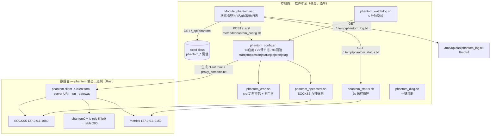

# Phantom koolshare 路由器插件

Phantom 的第 5 个客户端形态：**华硕路由器上的 koolshare 软件中心离线插件**（rogsoft / hnd-axhnd）。
装进 `/koolshare` 后，可在路由器 Web 管理界面直接管理 Phantom 透明网关，功能对齐 macOS / Android / HarmonyOS 客户端。

- 目标机型：RT-AX86U Pro（BCM4912，aarch64），固件 `3.0.0.4.388_24199_koolcenter`
- 同时兼容：其它 hnd/axhnd 机型（GT-AX6000、RT-AX88U、TUF-AX3000 等）、koolshare 梅林改版
- 无软件中心时（梅林 / 官方固件）自动降级到 `/jffs/phantom` 手动安装

> **动手前**：本插件不改 Rust 数据面，只做控制面外壳。所有能力都来自现有的
> `phantom client --tun --gateway`，指标来自 `127.0.0.1:9150/metrics`。
> 数据面契约见 [ARCHITECTURE.md](../../ARCHITECTURE.md)。

## 1. 功能

| 功能 | 实现 |
|---|---|
| 总开关 | dbus `phantom_enable`，关闭时停进程 + 回滚 ip rule / iptables |
| 连接串 | `phantom://<公钥>@<IP:端口>?psk=…`，password 输入 + 显示切换，日志脱敏 |
| 代理模式 | smart（默认，命中白名单才走隧道）/ proxy / direct |
| 传输协议 | TCP / QUIC（改写 URI 的 `proto=` 参数） |
| LAN 接口 / TUN / 路由表 | `--lan-interface`（可多个）、`--tun-name`、`--tun-addr`、`--table` |
| DNS 劫持 | 关闭时加 `--no-lan-dns-hijack` |
| 白名单 | 自定义域名 + 内置被墙域名表开关，写入 `proxy_domains.txt` 由 `PHANTOM_PROXY_DOMAINS` 注入 |
| 上下行速度 | 每 2 秒采样 `/metrics`，与上次快照求差算速率 |
| 定时重启 | `cru`（缺失回退 `crontab`），开机重注册、卸载清理 |
| 看门狗 | 每 5 分钟巡检，进程退出自动拉起 |
| 测速 | 经 SOCKS5 下载 5MB，给出吞吐 + 与服务端带宽天花板的对比结论 |
| 日志 | 页面 1.5 秒轮询，500 行 / 256KB 截断，一键清空（`/tmp/upload/phantom_log.txt`，页面读 `/_temp/phantom_log.txt`） |
| nat-start 兜底 | `init.d/N98phantom.sh`：Asuswrt 重建 iptables 后，只在规则确实丢了时才重启补回 |
| 皮肤 | ASUSWRT / ROG / TUF 三套，`/* W3C rogcss */`、`/* W3C asuscss */` 标记由 install.sh 切换 |

## 2. 架构：控制面与运行面



### 为什么这样切

| 决策 | 原因 |
|---|---|
| 状态用常驻采样循环，而不是「页面轮询触发后台脚本」 | 每次 `POST /_api/` 都会 spawn 一次 shell，2 秒一次对路由器太重 |
| 服务器用 `--server` 传、不写进 `client.toml` 的 servers 段 | 避免两处不一致；`--server` 会覆盖 servers 段，TOML 只管 `[client]` / `[rules]` |
| 白名单写文件 + `PHANTOM_PROXY_DOMAINS` 注入，不进 TOML | dbus 不支持多行文本；也避免用户可控内容拼进 TOML 造成注入 |
| 双架构二进制 + `uname -m` 选择 | hnd/axhnd 固件混用 aarch64 内核与 32 位 userspace，单架构必有一边跑不起来 |

## 3. 目录结构

```
client/koolshare/
├── README.md
├── VERSION                       # 与 workspace 版本对齐
└── phantom/                      # 离线包内容（解压后即 /tmp/phantom）
    ├── install.sh                # 平台检测 / 双架构选择 / 皮肤 sed / dbus 默认值 / init.d
    ├── uninstall.sh
    ├── version                   # 打包时由 workspace version 生成
    ├── .valid                    # 内容 "hnd"，软件中心离线包校验
    ├── res/      phantom.css、icon-phantom.png
    ├── scripts/  phantom_config.sh     总控（见第 4 节）
    │             phantom_status.sh     2s 采样
    │             phantom_speedtest.sh  吞吐探测
    │             phantom_cron.sh       定时任务
    │             phantom_watchdog.sh   看门狗
    │             phantom_diag.sh       一键诊断
    ├── webs/     Module_phantom.asp
    ├── bin/      phantom-aarch64 / phantom-armv7（打包注入，不入库）
    └── tests/    mock-bin/（dbus / nvram / cru / curl / phantom 替身）+ smoke.sh
```

## 4. 接口契约

### 4.1 `phantom_config.sh` action

| action | 行为 |
|---|---|
| `1` | 保存并应用（enable=1 则重启隧道） |
| `2` | 清空日志 |
| `3` | 测速 |
| `start` / `stop` / `restart` / `status` | 生命周期 |
| `start_nat` | nat-start 兜底：规则被 iptables 重建冲掉时重启补回 |
| `cron` | 按 dbus 幂等重注册定时任务 |
| `diag` | 输出诊断报告 |
| `ks <0\|1>` | 历史兼容入口（真实开机路径是 `init.d/S98phantom.sh start`） |

**两套调用方式都要认**（这里是全插件最容易踩的坑）：

```sh
# 1) 直接调用：action 在 $1
/bin/sh /koolshare/scripts/phantom_config.sh 1
/bin/sh /koolshare/scripts/phantom_config.sh start_nat

# 2) 软件中心 POST：$1 是请求 id，action 在 $2
#    POST /_api/ {"id":123,"method":"phantom_config.sh","params":["1"],"fields":{…}}
/bin/sh /koolshare/scripts/phantom_config.sh 123 1
```

httpdb 先把 `fields` 写进 dbus，再执行 `/koolshare/scripts/<method> <id> <params...>`；
脚本必须 POST 回 `http://127.0.0.1:3030/_resp/<id>`（body 就是那个 id）它才结束 HTTP
请求。**不回包的后果**：页面一直转圈，最后弹「后台执行失败，请看日志页」，而隧道其实
什么也没做 —— 现象与「真的失败」完全一样，只能靠 `/tmp/upload/phantom_log.txt` 区分。
`phantom_config.sh` 的 `api_ack()` 负责这件事，位置固定在 dispatch 之前。

### 4.2 dbus 键

| 键 | 默认 | 说明 |
|---|---|---|
| `phantom_enable` | `0` | 总开关 |
| `phantom_uri` | 空 | 连接串，**服务端必须是 IP:Port** |
| `phantom_mode` | `smart` | smart / proxy / direct |
| `phantom_protocol` | `tcp` | tcp / quic |
| `phantom_lan_if` | `br0` | 空格分隔，可多个 |
| `phantom_tun_name` / `phantom_tun_addr` | `phantom0` / `10.7.0.1/24` | TUN（地址不得与 LAN 网段重叠） |
| `phantom_table` | `200` | 策略路由表 |
| `phantom_dns_hijack` | `1` | LAN 53 端口导入隧道 |
| `phantom_builtin_wl` | `1` | 内置被墙域名表 |
| `phantom_whitelist` | 空 | 自定义域名，**逗号分隔单行** |
| `phantom_cron_enable` / `phantom_cron_time` | `0` / `4:30` | 定时重启 |
| `phantom_watchdog` | `1` | 看门狗 |
| `phantom_log_level` | `info` | error / warn / info / debug |
| `phantom_server_up_mbps` / `phantom_server_down_mbps` | `3` / `5` | 服务端带宽，用于解读测速结果 |
| `phantom_last_act` / `phantom_speed_last` / `phantom_watchdog_fails` | — | 运行状态回显 |
| `softcenter_module_phantom_{version,install,name,title,description}` | — | 软件中心要求 |

### 4.3 前端 API（koolshare 1.5 代）

| 用途 | 调用 |
|---|---|
| 读配置 | `GET /_api/phantom` → `data.result[0]` |
| 提交 | `POST /_api/`，体 `{"id":N,"method":"phantom_config.sh","params":["1"],"fields":{…}}`；脚本执行时 `$1=id`、`$2=action`，并回包 `/_resp/<id>` |
| 状态 | `GET /_temp/phantom_status.txt`（首选，物理文件 `/tmp/upload/phantom_status.txt`） |
| 日志 | `GET /_temp/phantom_log.txt`（首选，物理文件 `/tmp/upload/phantom_log.txt`） |

> **运行期文件在 tmpfs，经 httpdb 的 `/_temp/` 暴露。**
> 状态每 2 秒更新一次，写 JFFS 会磨损 flash，所以文件本身在 `/tmp/upload`；
> 页面读的是 httpdb 的 `/_temp/<名字>`（映射 `/tmp/upload/<名字>`），这也是软件中心
> 自己的做法（`/tmp/upload/soft_log.txt` ↔ `/_temp/soft_log.txt`）。
>
> **为什么不用 docroot 软链**：实测本固件 httpd **不服务 docroot 下的 `.txt`** ——
> `GET /phantom_status.txt` 与固件自带的 `GET /Lang_Hdr.txt` 同为 404，与权限、
> 软链都无关（`.asp` / `.js` / `.css` / `.png` 正常）。早期版本把文件软链进
> `/koolshare/webs`，页面因此永远读不到状态与日志，表现为「状态卡一直未运行、
> 日志页空白」。前端保留 docroot 路径仅作其它固件的兜底。
>
> pidfile 仍在 `/tmp` —— 重启后自动清空，避免陈旧 pid 被复用导致误判「服务已在运行」。

### 4.4 安装布局文件

`install.sh` 生成 `/koolshare/etc/phantom/phantom.env`，所有脚本启动时 source 它来定位目录：

```
PHANTOM_KS / PHANTOM_SCRIPTS_DIR / PHANTOM_BIN_DIR / PHANTOM_RUNTIME_DIR
PHANTOM_LOG / PHANTOM_STATUS / PHANTOM_PIDFILE
PHANTOM_STATUS_PIDFILE / PHANTOM_CONF / PHANTOM_DOMAINS / PHANTOM_UI
```

## 5. 构建与安装

```bash
# 出离线包（双架构静态二进制，产物 dist/phantom-<version>.tar.gz + .sha256）
cargo xtask package koolshare
```

安装（三选一）：

```bash
# 1) 软件中心 → 离线安装 → 上传 tar.gz（最省事）
# 2) scp 后手工执行，等价于软件中心的行为
tar czf /tmp/phantom.tar.gz -C client/koolshare phantom     # 或直接 dist/phantom-*.tar.gz
scp -P <SSH端口> dist/phantom-0.1.0.tar.gz admin@<路由器IP>:/tmp/
ssh -p <SSH端口> admin@<路由器IP> 'tar xzf /tmp/phantom-0.1.0.tar.gz -C /tmp && /bin/sh /tmp/phantom/install.sh'
# 3) 无软件中心的固件：同一个 install.sh 会自动走 /jffs/phantom 降级安装
```

打开 `http://<路由器IP>/Module_phantom.asp` 配置。

> 若路由器把 SSH 端口改成了非 22（示例写作 `<SSH端口>`），命令统一写 `ssh -p <SSH端口> admin@<路由器IP>` ——
> `-p` 必须在 host **之前**，写成 `ssh admin@<路由器IP> -p <SSH端口>` 会被当成远端命令。

## 6. 调试（重点）

### 6.1 迭代闭环：不要每次重装插件

```bash
# 只改后台脚本
scp -P <SSH端口> client/koolshare/phantom/scripts/phantom_config.sh admin@<路由器IP>:/koolshare/scripts/
ssh -p <SSH端口> admin@<路由器IP> 'chmod 755 /koolshare/scripts/phantom_*.sh && /bin/sh -x /koolshare/scripts/phantom_config.sh restart'

# 只改页面（ASP 是静态文件，httpd 无需重启）
scp -P <SSH端口> client/koolshare/phantom/webs/Module_phantom.asp admin@<路由器IP>:/koolshare/webs/
# 浏览器 Ctrl+F5

# 只换二进制
scp -P <SSH端口> target/aarch64-unknown-linux-musl/release/phantom admin@<路由器IP>:/koolshare/bin/phantom-aarch64
ssh -p <SSH端口> admin@<路由器IP> '/bin/sh /koolshare/scripts/phantom_config.sh restart'
```

`sh -x` 是 ash 上最强的一招：直接看到 dbus 取值、参数拼装、分支走向。

> 布局或钩子有变动（`install.sh` / `uninstall.sh` / `phantom.env`）时必须重装一次，
> 不能只 scp 单个脚本 —— 否则 `/tmp/upload` 路径与 `N98phantom.sh` 钩子不会更新。

### 6.2 浏览器 / 软件中心侧

- `http://<路由器IP>/_api/phantom` 直接看 dbus JSON（键是否写全、值是否被截断）
- F12 → Network 看 `POST /_api/` 返回的 `result` 是否等于请求 `id`（不等即脚本执行失败）
- **提交既要异步 XHR，也要后端后台派发**（这两条缺一条都会「卡死」）：
  - 前端：`async: false` 会冻住浏览器主线程；
  - 后端：软件中心是**同步执行**后台脚本的，`POST /_api/` 会一直等到脚本退出。
    若 `apply` 在前台做 `stop`（最多 3 秒）+ `sleep 3`（等 Hello），请求就长时间不返回；
    只要还有后台子进程继承了 CGI 的输出管道，请求甚至**永不返回** —— 现象就是
    「点提交后页面永久卡死」。

  因此 `apply` / 测速只做「存配置 + `detach_run` 派发」后立刻返回，
  前端用 `wait_started` / `poll_speed_result` 轮询状态文件与 `phantom_speed_last`
  把结果呈现出来。冒烟测试对这两条都有断言。
- **后端必须回包 `/_resp/<id>`**：httpdb 会一直挂着那个 HTTP 请求直到脚本回包，
  不回包就是「转圈 → 后台执行失败」。`api_ack()` 的位置不能挪到耗时动作之后。
  冒烟测试用 mock curl 捕获回包，断言 URL 与 body。
- 直接 `GET /_temp/phantom_status.txt`、`/_temp/phantom_log.txt` 验证可读
  （物理文件在 `/tmp/upload/`；docroot 下的 `.txt` 恒 404，别在那浪费时间）
- 皮肤：改完标记行强制刷新，确认三套主色

### 6.3 数据面（不经过 UI）

```bash
ssh -p <SSH端口> admin@<路由器IP> 'dbus set phantom_mode="proxy"; /bin/sh /koolshare/scripts/phantom_config.sh 1'
ssh -p <SSH端口> admin@<路由器IP> 'curl -s --max-time 2 http://127.0.0.1:9150/metrics | grep ^phantom'
ssh -p <SSH端口> admin@<路由器IP> 'ip rule show | grep -E "lookup (main|200)"; ip route show table 200; ip link show phantom0'
# 隧道连通性：路由器自身是直连的，必须显式走 SOCKS5 才测得准
ssh -p <SSH端口> admin@<路由器IP> 'curl -s -o /dev/null -w "%{http_code} %{time_total}\n" --socks5-hostname 127.0.0.1:1080 https://www.google.com/generate_204'
```

### 6.4 一键诊断

```bash
ssh -p <SSH端口> admin@<路由器IP> '/bin/sh /koolshare/scripts/phantom_config.sh diag' > /tmp/phantom_diag.txt
```

采集：固件与内核、脱敏后的 dbus、进程与 CPU、`ip rule/route/link`、iptables 摘要、
`/proc/net/dev`、两次 metrics 采样（间隔 3s）、最近 200 行日志、cru 条目、磁盘。

### 6.5 无真机的防线

```bash
# L0 语法
cd client/koolshare/phantom && for f in install.sh uninstall.sh scripts/*.sh; do sh -n "$f"; done

# L1 容器（真实 busybox + 绝对路径）
podman run --rm -v "$PWD:/src" -w /src alpine:3.19 sh client/koolshare/phantom/tests/smoke.sh

# L1' 无容器引擎时：假根前缀，把 /koolshare 等重写到临时目录
PHANTOM_SMOKE_ROOT=/tmp/phantom-smoke sh client/koolshare/phantom/tests/smoke.sh
PHANTOM_SMOKE_ROOT=/tmp/ps-jffs PHANTOM_SMOKE_MODE=jffs sh client/koolshare/phantom/tests/smoke.sh
```

冒烟测试覆盖安装 → 默认配置 → **页面自检** → **脚本自检（裸 sh / command -v）** → 后台派发自检 →
运行期文件布局 → 皮肤 → 启动 → 采样 → **软件中心调用约定（回包 /_resp/<id>）** →
**start_nat 条件重启** → 测速 → 定时任务 → 诊断 → 停止 → 卸载，
两种模式各 97 项断言。

> **页面自检**专治「打开页面没反应」：JS 里 `params_inp` / `params_chk` 列出的每个 id 都必须
> 在 DOM 里真实存在（少一个就会在 `conf2obj()` 里访问 null 并中断整个初始化），
> 另加一次内联 JS 语法检查（有 `node` 时）。
> 这个坑只有浏览器能触发，靠它才拦得住。

### 6.6 真机在线核查（纯只读）

```bash
bash client/koolshare/tools/live-check.sh --host <路由器IP> --port <SSH端口>
```

一次性收集：机型/固件/内核、**安装文件指纹（ASP md5 + 行数 + UI rev，并与本机源码
逐项比对）**、`/tmp/upload` 运行期文件与历史死软链、init.d 的 S/N 钩子、
进程与 ip rule / iptables 残留、httpdb:3030、cru 条目、脚本语法、空间、日志尾部、
dbus 键（URI 已脱敏）。

> 能力探测一律走**绝对路径**：本机 busybox 没有 `command -v`，用它会把「装了 dbus、
> 有 cru」误报成缺失（早期版本的 live-check 就踩了这个坑）。
> 全程只读，不动任何配置，可在有真实设备的线上环境安全执行。

> 页面右上角显示 `UI r<n>`：改了前端但「没生效」时，先看这个数字确认浏览器加载的是哪一版。
> 换版本时可以用 `Module_phantom.asp?v=<n>` 绕过浏览器缓存。

## 7. 性能

### 7.1 天花板（先看这个再判断快慢）

服务端带宽 **上行 3 Mbps / 下行 5 Mbps**。方向是反的：

| 客户端动作 | 占用服务端 | 理论上限 |
|---|---|---|
| 下载 | 服务端**上行** 3 Mbps | ≈ 375 KB/s |
| 上传 | 服务端**下行** 5 Mbps | ≈ 625 KB/s |

所以 **下载跑到 0.35 MB/s 左右就到顶了**，再低才是需要排查的问题。
`phantom_speedtest.sh` 会在日志里给出「达到服务端带宽上限的百分之多少」：

- ≥ 80%：链路健康，想更快只能换服务器
- 50–80%：可尝试调 TUN MTU、检查 RTT、换 QUIC
- < 50%：排查路由器 CPU、TUN 写队列峰值、重传、是否走了错误链路

### 7.2 测量项

| 维度 | 命令 |
|---|---|
| 进程 CPU | `top -b -n 1`、`ps -o pid,pcpu,pmem,comm -p $(cat /tmp/phantom.pid)` |
| TUN 收发 | `ip -s link show phantom0`、`/proc/net/dev`（与 metrics 对账） |
| 软中断 | `cat /proc/softirqs`（NET_RX/NET_TX） |
| TUN 健康度 | `curl -s 127.0.0.1:9150/metrics \| grep -E 'dup\|tun_write\|txq\|route_direct_failed'` |

`phantom_tcp_dup_bytes`、`phantom_tun_write_wait_max_ms`、`phantom_tun_txq_peak_bytes`、
`phantom_route_direct_failed_total` 这几个是排查「隧道正常但应用卡住」的关键：
卡死的流仍在传输字节（全是重传），光看 `bytes_up/down` 分辨不出来。

### 7.3 调优顺序

1. 日志级别保持 `info`（debug 会明显吃 CPU）；采样周期默认 2 秒，CPU 紧张可放宽
2. 确认 `cipher` 命中 AES-256-GCM（BCM4912 有 ARM CE），没退化到 ChaCha20 / Ascon
3. TUN MTU 与 TCP 窗口：5 Mbps × RTT 决定 BDP，参考 `client/src/net_tune.rs`
4. 比对路由器侧测速与 LAN 客户端实测，差值即 LAN→TUN 的 NAT 转发损耗

真机基线记录在 [`tests/PERF_ROUTER_REPORT.md`](../../tests/PERF_ROUTER_REPORT.md)。

## 8. 真机验收清单

- [ ] 软件中心 → 离线安装成功（`.valid` 校验通过）
- [ ] 非 hnd/axhnd 平台被拒绝安装并给出可读提示
- [ ] 双架构：按 `uname -m` 选中正确二进制并启动
- [ ] **页面点「提交」毫秒级返回**，不再转圈、不弹「后台执行失败」，`上次动作` 变「已启动」
- [ ] 开关：开→LAN 客户端能走隧道；关→进程与 ip rule / iptables 完全回退
- [ ] 状态卡 2s 刷新（`/_temp/phantom_status.txt` 可读），速率与累计流量和 `/metrics` 对得上
- [ ] 白名单：加一条域名后该域名走隧道，其余仍直连
- [ ] 定时重启：`cru l` 有条目且到点生效；关闭后条目消失
- [ ] 测速：结果接近服务端带宽天花板，页面口径说明清楚
- [ ] 日志：页面可读（`/_temp/phantom_log.txt`）、滚动 / 清空 / 截断生效，不无限增长
- [ ] 三皮肤主色正确
- [ ] 路由器重启后自动拉起（`S98phantom.sh`）；`nat-start` 后规则被冲掉能自动补回（`N98phantom.sh`）
- [ ] 卸载：文件、init.d 软链（S/N）、cru 条目、dbus 键、iptables 残留全部清理

## 9. 已知约束

- **服务端地址必须是 IP:Port**：`phantom` 直接按 `SocketAddr` 解析、不做 DNS。
  填域名时脚本会用 `nslookup` 兜底，但不保证成功，UI 也提示了这一点。
- **测速不等于网速**：经 SOCKS5 下载测得的是 phantom 用户态转发吞吐，不含 LAN→TUN 的 NAT 路径。
- **本机固件的 `/usr/sbin/sh` 是 Broadcom 调试工具（软链到 `/bin/memaccess`），不是 shell**，
  而 sshd / cron 的非交互 `PATH` 把 `/usr/sbin` 排在 `/bin` 前面 —— 所以命令要写
  `/bin/sh`，脚本内部也一律用绝对路径（`$SH`）。用裸 `sh` 会看到 `Address xxx is invalid`
  或 `dw/dh/db` 用法提示。冒烟测试里有静态检查拦这条。
- **本机固件的 busybox 没有 `command -v`（也没有 `type`）** —— 用它做能力探测会得到
  "command: not found" 并**静默走错分支**。曾经让「是否能用 dbus」的判定永远为假，
  插件退化成读空配置，表现为「提交后永不启动」。因此所有外部命令都走 `cmd_path()`
  按绝对路径查找，关键命令（dbus/curl/wget/cru/setsid）的路径在安装时探测好写进
  `phantom.env`（`PHANTOM_DBUS` / `PHANTOM_CURL` / ...）。冒烟测试有静态检查拦这条。
- **httpd 不服务 docroot 下的 `.txt`**：`GET /phantom_status.txt` 与固件自带的
  `GET /Lang_Hdr.txt` 同为 404（`.asp`/`.js`/`.css`/`.png` 都正常），所以状态与日志
  只能走 httpdb 的 `/_temp/` 通道（物理目录 `/tmp/upload`）。别再尝试往
  `/koolshare/webs` 或 `/www/_temp` 铺软链。
- **软件中心 POST 的调用约定**：`$1` 是请求 id、action 在 `$2`，并且脚本必须回包
  `http://127.0.0.1:3030/_resp/<id>`。这两条任缺其一，页面的表现都是「卡住 →
  后台执行失败」。参照 `ks_app_install.sh` / `clash_downyamlsel.sh` 的写法。
- **开机与 nat 钩子的参数**：`S*` 由 `ks-wan-start.sh` 以 `start` 调用，
  `N*` 由 `ks-nat-start.sh` 以 `start_nat` 调用 —— `ks <0|1>` 只是历史兼容入口。
- **测速需要带 SOCKS 支持的 curl**：本固件自带的 `/usr/sbin/curl` 是
  `--disable-proxy` 编译的，一调 `--socks5-hostname` 就报
  `proxy support is disabled in this libcurl`（返回 000），而 **koolshare 自带的
  `/koolshare/bin/curl-fancyss` 可用**。`install.sh` 会按「真调一次 SOCKS」探测，
  把可用路径写进 `phantom.env` 的 `PHANTOM_CURL_SOCKS`；两者都没有时测速会写一条
  明确的失败原因到 `phantom_speed_last`，不会静默失败。
- **测速百分比要单位对齐**：`size_download/speed_download` 给的是 bytes/s，
  与「服务端上行 Mbps」比较前都要换算成 kbps（曾经拿 kbps 除 KB/s，真机上打出
  「达到 786%」）。
- 状态与日志在 `/tmp/upload`（tmpfs），**重启路由器后清空**；日志截断 500 行 / 256KB。
- 路由器的 shell 是 BusyBox ash：脚本必须 POSIX，`sed -i` 要写成「临时文件 + mv」；
  heredoc 里不要写反引号（会被命令替换求值）。
