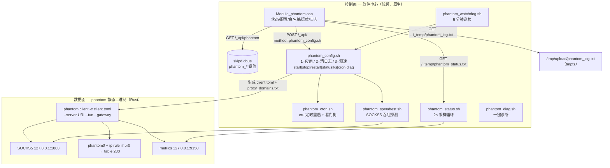

# Phantom koolshare 路由器插件

Phantom 的第 5 个客户端形态：**华硕路由器上的 koolshare 软件中心离线插件**（rogsoft / hnd-axhnd）。
装进 `/koolshare` 后，可在路由器 Web 管理界面直接管理 Phantom 透明网关，功能对齐 macOS / Android / HarmonyOS 客户端。

- 目标机型：RT-AX86U Pro（BCM4912，aarch64），固件 `3.0.0.4.388_24199_koolcenter`
- 同时兼容：其它 hnd/axhnd 机型（GT-AX6000、RT-AX88U、TUF-AX3000 等）、koolshare 梅林改版
- 无软件中心时（梅林 / 官方固件）自动降级到 `/jffs/phantom` 手动安装

> **动手前**：本插件不改 Rust 数据面，只做控制面外壳。所有能力都来自现有的
> `phantom client --tun --gateway`，指标来自 `127.0.0.1:9150/metrics`。
> 数据面契约见 [ARCHITECTURE.md](../../ARCHITECTURE.md)。

## 1. 功能

| 功能 | 实现 |
|---|---|
| 总开关 | dbus `phantom_enable`，关闭时停进程 + 回滚 ip rule / iptables |
| 连接串 | `phantom://<公钥>@<IP:端口>?psk=…`，password 输入 + 显示切换，日志脱敏 |
| 代理模式 | smart（默认，命中白名单才走隧道）/ proxy / direct |
| 传输协议 | TCP / QUIC（改写 URI 的 `proto=` 参数） |
| LAN 接口 / TUN / 路由表 | `--lan-interface`（可多个）、`--tun-name`、`--tun-addr`、`--table` |
| DNS 劫持 | 关闭时加 `--no-lan-dns-hijack` |
| 白名单 | 自定义域名 + 内置被墙域名表开关，写入 `proxy_domains.txt` 由 `PHANTOM_PROXY_DOMAINS` 注入 |
| 上下行速度 | 每 2 秒采样 `/metrics`，与上次快照求差算速率 |
| 定时重启 | `cru`（缺失回退 `crontab`），开机重注册、卸载清理 |
| 看门狗 | 每 5 分钟巡检，进程退出自动拉起 |
| 测速 | 经 SOCKS5 下载 5MB，给出吞吐 + 与服务端带宽天花板的对比结论 |
| 日志 | 页面 1.5 秒轮询，500 行 / 256KB 截断，一键清空（`/tmp/upload/phantom_log.txt`，页面读 `/_temp/phantom_log.txt`） |
| nat-start 兜底 | `init.d/N98phantom.sh`：Asuswrt 重建 iptables 后，只在规则确实丢了时才重启补回 |
| 皮肤 | ASUSWRT / ROG / TUF 三套，`/* W3C rogcss */`、`/* W3C asuscss */` 标记由 install.sh 切换 |
| 分流模式 | 内核分流（ipset+fwmark，默认）/ 兼容模式（用户态 relay），页面可切换，缺 ipset 时自动回退 |
| 加密 DNS 拦截 | 默认拦掉 LAN 侧 DoT(853) 与已知 DoH 解析器，保证域名分流的学习链不断 |
| 性能采样 | `phantom_perf.sh` 每 5 分钟一行：CPU、连接数、fd、flow-cache 命中、直连/隧道字节、DNS/RTT/丢包、无线客户端数、口速率 |

## 2. 架构：控制面与运行面


```mermaid
graph TB
  subgraph 控制面["控制面 — 软件中心（低频、原生）"]
    ASP["Module_phantom.asp<br/>状态/配置/白名单/运维/日志"]
    DBUS[("skipd dbus<br/>phantom_* 键值")]
    CONF["phantom_config.sh<br/>1=应用 / 2=清日志 / 3=测速<br/>start|stop|restart|status|ks|cron|diag"]
    CRON["phantom_cron.sh<br/>cru 定时重启 + 看门狗"]
    ST["phantom_status.sh<br/>2s 采样循环"]
    SP["phantom_speedtest.sh<br/>SOCKS5 吞吐探测"]
    WD["phantom_watchdog.sh<br/>5 分钟巡检"]
    DG["phantom_diag.sh<br/>一键诊断"]
  end
  subgraph 数据面["数据面 — phantom 静态二进制（Rust）"]
    BIN["phantom client -c client.toml<br/>--server URI --tun --gateway"]
    S5["SOCKS5 127.0.0.1:1080"]
    TUN["phantom0 + ip rule iif br0 → table 200"]
    MET["metrics 127.0.0.1:9150"]
  end
  ASP -->|"GET /_api/phantom"| DBUS
  ASP -->|"POST /_api/ method=phantom_config.sh"| CONF
  ASP -->|"GET /_temp/phantom_status.txt"| ST
  ASP -->|"GET /_temp/phantom_log.txt"| LOG["/tmp/upload/phantom_log.txt（tmpfs）"]
  CONF --> CRON
  CONF --> SP
  CONF -->|"生成 client.toml + proxy_domains.txt"| BIN
  BIN --> S5 & TUN & MET
  ST --> MET
  SP --> S5
  WD --> CONF
```

### 为什么这样切

| 决策 | 原因 |
|---|---|
| 状态用常驻采样循环，而不是「页面轮询触发后台脚本」 | 每次 `POST /_api/` 都会 spawn 一次 shell，2 秒一次对路由器太重 |
| 服务器用 `--server` 传、不写进 `client.toml` 的 servers 段 | 避免两处不一致；`--server` 会覆盖 servers 段，TOML 只管 `[client]` / `[rules]` |
| 白名单写文件 + `PHANTOM_PROXY_DOMAINS` 注入，不进 TOML | dbus 不支持多行文本；也避免用户可控内容拼进 TOML 造成注入 |
| 双架构二进制 + `uname -m` 选择 | hnd/axhnd 固件混用 aarch64 内核与 32 位 userspace，单架构必有一边跑不起来 |

## 3. 目录结构

```
client/koolshare/
├── README.md
├── VERSION                       # 与 workspace 版本对齐
└── phantom/                      # 离线包内容（解压后即 /tmp/phantom）
    ├── install.sh                # 平台检测 / 双架构选择 / 皮肤 sed / dbus 默认值 / init.d
    ├── uninstall.sh
    ├── version                   # 打包时由 workspace version 生成
    ├── .valid                    # 内容 "hnd"，软件中心离线包校验
    ├── res/      phantom.css、icon-phantom.png
    ├── scripts/  phantom_config.sh     总控（见第 4 节）
    │             phantom_status.sh     2s 采样
    │             phantom_speedtest.sh  吞吐探测
    │             phantom_cron.sh       定时任务
    │             phantom_watchdog.sh   看门狗
    │             phantom_diag.sh       一键诊断
    ├── webs/     Module_phantom.asp     管理页（rev 见页头）
    │             Module_phantom_ping.asp  会话探针页（httpdb 请求前的 .asp 预检）
    │                                    名字必须以 Module_ 开头，见 §9
    ├── bin/      phantom-aarch64 / phantom-armv7（打包注入，不入库）
    └── tests/    mock-bin/（dbus / nvram / cru / curl / phantom 替身）+ smoke.sh
```

## 4. 接口契约

### 4.1 `phantom_config.sh` action

| action | 行为 |
|---|---|
| `1` | 保存并应用（enable=1 则重启隧道） |
| `2` | 清空日志 |
| `3` | 测速 |
| `start` / `stop` / `restart` / `status` | 生命周期 |
| `start_nat` | nat-start 兜底：规则被 iptables 重建冲掉时重启补回 |
| `cron` | 按 dbus 幂等重注册定时任务 |
| `diag` | 输出诊断报告 |
| `_trim` | 内部入口：只裁剪日志（看门狗每 5 分钟调用） |
| `ks <0\|1>` | 历史兼容入口（真实开机路径是 `init.d/S98phantom.sh start`） |

**两套调用方式都要认**（这里是全插件最容易踩的坑）：

```sh
# 1) 直接调用：action 在 $1
/bin/sh /koolshare/scripts/phantom_config.sh 1
/bin/sh /koolshare/scripts/phantom_config.sh start_nat

# 2) 软件中心 POST：$1 是请求 id，action 在 $2
#    POST /_api/ {"id":123,"method":"phantom_config.sh","params":["1"],"fields":{…}}
/bin/sh /koolshare/scripts/phantom_config.sh 123 1
```

httpdb 先把 `fields` 写进 dbus，再执行 `/koolshare/scripts/<method> <id> <params...>`；
脚本必须 POST 回 `http://127.0.0.1:3030/_resp/<id>`（body 就是那个 id）它才结束 HTTP
请求。**不回包的后果**：页面一直转圈，最后弹「后台执行失败，请看日志页」，而隧道其实
什么也没做 —— 现象与「真的失败」完全一样，只能靠 `/tmp/upload/phantom_log.txt` 区分。
`phantom_config.sh` 的 `api_ack()` 负责这件事，位置固定在 dispatch 之前。

### 4.2 dbus 键

| 键 | 默认 | 说明 |
|---|---|---|
| `phantom_enable` | `0` | 总开关 |
| `phantom_uri` | 空 | 连接串，**服务端必须是 IP:Port** |
| `phantom_mode` | `smart` | smart / proxy / direct |
| `phantom_protocol` | `tcp` | tcp / quic |
| `phantom_lan_if` | `br0` | 空格分隔，可多个 |
| `phantom_tun_name` / `phantom_tun_addr` | `phantom0` / `10.7.0.1/24` | TUN（地址不得与 LAN 网段重叠） |
| `phantom_table` | `200` | 策略路由表 |
| `phantom_dns_hijack` | `1` | LAN 53 端口导入隧道 |
| `phantom_builtin_wl` | `1` | 内置被墙域名表 |
| `phantom_whitelist` | 空 | 自定义域名，**逗号分隔单行**（dbus 存不了多行：页面把多行/空格折成逗号分隔，脚本侧再把字面 `\n`、空白一并当分隔符兜底） |
| `phantom_cron_enable` / `phantom_cron_time` | `0` / `4:30` | 定时重启 |
| `phantom_watchdog` | `1` | 看门狗 |
| `phantom_log_level` | `warn` | error / warn / info / debug（info 会为每条连接/路由打一行，夜里费 CPU 与 tmpfs） |
| `phantom_gateway_mode` | `kernel-split` | `kernel-split`（只把白名单目标送进 TUN，直连走内核快路径）/ `relay`（全部进 TUN 用户态判定） |
| `phantom_block_doh` | `1` | 拦截 LAN 侧加密 DNS（DoT/DoH），保证域名→IP 的学习链不断 |
| `phantom_server_up_mbps` / `phantom_server_down_mbps` | `3` / `5` | 服务端带宽，用于解读测速结果 |
| `phantom_last_act` / `phantom_speed_last` / `phantom_watchdog_fails` | — | 运行状态回显 |
| `softcenter_module_phantom_{version,install,name,title,description}` | — | 软件中心要求 |

### 4.3 前端 API（koolshare 1.5 代）

| 用途 | 调用 |
|---|---|
| 读配置 | `GET /_api/phantom` → `data.result[0]` |
| 提交 | `POST /_api/`，体 `{"id":N,"method":"phantom_config.sh","params":["1"],"fields":{…}}`；脚本执行时 `$1=id`、`$2=action`，并回包 `/_resp/<id>` |
| 会话探针 | `GET /Module_phantom_ping.asp`（正文含 `phantom-ping-ok`；取不到时回退 `GET /Module_phantom.asp` 本体）；**httpdb 请求之前必须先打它**，见 §9 |
| 状态 | `GET /_temp/phantom_status.txt`（首选，物理文件 `/tmp/upload/phantom_status.txt`） |
| 日志 | `GET /_temp/phantom_log.txt`（首选，物理文件 `/tmp/upload/phantom_log.txt`） |
| 上次动作 | 随状态文件带回（`"last_act"` 字段）；`GET /_api/phantom_last_act` 仍保留给 SSH / 其它工具 |

> **运行期文件在 tmpfs，经 httpdb 的 `/_temp/` 暴露。**
> 状态每 2 秒更新一次，写 JFFS 会磨损 flash，所以文件本身在 `/tmp/upload`；
> 页面读的是 httpdb 的 `/_temp/<名字>`（映射 `/tmp/upload/<名字>`），这也是软件中心
> 自己的做法（`/tmp/upload/soft_log.txt` ↔ `/_temp/soft_log.txt`）。
>
> **为什么不用 docroot 软链**：实测本固件 httpd **不服务 docroot 下的 `.txt`** ——
> `GET /phantom_status.txt` 与固件自带的 `GET /Lang_Hdr.txt` 同为 404，与权限、
> 软链都无关（`.asp` / `.js` / `.css` / `.png` 正常）。早期版本把文件软链进
> `/koolshare/webs`，页面因此永远读不到状态与日志，表现为「状态卡一直未运行、
> 日志页空白」。前端保留 docroot 路径仅作其它固件的兜底。
>
> pidfile 仍在 `/tmp` —— 重启后自动清空，避免陈旧 pid 被复用导致误判「服务已在运行」。

### 4.4 安装布局文件

`install.sh` 生成 `/koolshare/etc/phantom/phantom.env`，所有脚本启动时 source 它来定位目录：

```
PHANTOM_KS / PHANTOM_SCRIPTS_DIR / PHANTOM_BIN_DIR / PHANTOM_RUNTIME_DIR
PHANTOM_LOG / PHANTOM_STATUS / PHANTOM_PIDFILE
PHANTOM_STATUS_PIDFILE / PHANTOM_CONF / PHANTOM_DOMAINS / PHANTOM_UI
```

## 5. 构建与安装

```bash
# 出离线包（双架构静态二进制，产物 dist/phantom-<version>.tar.gz + .sha256）
cargo xtask package koolshare
```

安装（三选一）：

```bash
# 1) 软件中心 → 离线安装 → 上传 tar.gz（最省事）
# 2) scp 后手工执行，等价于软件中心的行为
tar czf /tmp/phantom.tar.gz -C client/koolshare phantom     # 或直接 dist/phantom-*.tar.gz
scp -P <SSH端口> dist/phantom-0.1.0.tar.gz admin@<路由器IP>:/tmp/
ssh -p <SSH端口> admin@<路由器IP> 'tar xzf /tmp/phantom-0.1.0.tar.gz -C /tmp && /bin/sh /tmp/phantom/install.sh'
# 3) 无软件中心的固件：同一个 install.sh 会自动走 /jffs/phantom 降级安装
```

打开 `http://<路由器IP>/Module_phantom.asp` 配置。

> 若路由器把 SSH 端口改成了非 22（示例写作 `<SSH端口>`），命令统一写 `ssh -p <SSH端口> admin@<路由器IP>` ——
> `-p` 必须在 host **之前**，写成 `ssh admin@<路由器IP> -p <SSH端口>` 会被当成远端命令。

## 6. 调试（重点）

### 6.1 迭代闭环：不要每次重装插件

```bash
# 只改后台脚本
scp -P <SSH端口> client/koolshare/phantom/scripts/phantom_config.sh admin@<路由器IP>:/koolshare/scripts/
ssh -p <SSH端口> admin@<路由器IP> 'chmod 755 /koolshare/scripts/phantom_*.sh && /bin/sh -x /koolshare/scripts/phantom_config.sh restart'

# 只改页面（ASP 是静态文件，httpd 无需重启）
scp -P <SSH端口> client/koolshare/phantom/webs/Module_phantom.asp admin@<路由器IP>:/koolshare/webs/
# 浏览器 Ctrl+F5

# 只换二进制
scp -P <SSH端口> target/aarch64-unknown-linux-musl/release/phantom admin@<路由器IP>:/koolshare/bin/phantom-aarch64
ssh -p <SSH端口> admin@<路由器IP> '/bin/sh /koolshare/scripts/phantom_config.sh restart'
```

`sh -x` 是 ash 上最强的一招：直接看到 dbus 取值、参数拼装、分支走向。

> 布局或钩子有变动（`install.sh` / `uninstall.sh` / `phantom.env`）时必须重装一次，
> 不能只 scp 单个脚本 —— 否则 `/tmp/upload` 路径与 `N98phantom.sh` 钩子不会更新。

### 6.2 浏览器 / 软件中心侧

- `http://<路由器IP>/_api/phantom` 直接看 dbus JSON（键是否写全、值是否被截断）
- F12 → Network 看 `POST /_api/` 返回的 `result` 是否等于请求 `id`（不等即脚本执行失败）
- **提交既要异步 XHR，也要后端后台派发**（这两条缺一条都会「卡死」）：
  - 前端：`async: false` 会冻住浏览器主线程；
  - 后端：软件中心是**同步执行**后台脚本的，`POST /_api/` 会一直等到脚本退出。
    若 `apply` 在前台做 `stop`（最多 3 秒）+ `sleep 3`（等 Hello），请求就长时间不返回；
    只要还有后台子进程继承了 CGI 的输出管道，请求甚至**永不返回** —— 现象就是
    「点提交后页面永久卡死」。

  因此 `apply` / 测速只做「存配置 + `detach_run` 派发」后立刻返回，
  前端用 `wait_started` / `poll_speed_result` 轮询状态文件与 `phantom_speed_last`
  把结果呈现出来。冒烟测试对这两条都有断言。
- **后端必须回包 `/_resp/<id>`**：httpdb 会一直挂着那个 HTTP 请求直到脚本回包，
  不回包就是「转圈 → 后台执行失败」。`api_ack()` 的位置不能挪到耗时动作之后。
  冒烟测试用 mock curl 捕获回包，断言 URL 与 body。
- 直接 `GET /_temp/phantom_status.txt`、`/_temp/phantom_log.txt` 验证可读
  （物理文件在 `/tmp/upload/`；docroot 下的 `.txt` 恒 404，别在那浪费时间）
- 皮肤：改完标记行强制刷新，确认三套主色
- **「提交失败（请求未完成）」先看 httpd 崩没崩**（本固件最容易踩的一条）：

  ```bash
  # 崩溃计数与最近一次崩溃时间（有崩溃就是它把在途的 POST 掐断了）
  ssh -p <SSH端口> admin@<路由器IP> "grep -c 'Comm: httpd' /tmp/syslog.log; grep 'Comm: httpd' /tmp/syslog.log | tail -1"
  # 会话自动登出时长（默认 30 分钟；过期后页面拿着旧 token 访问 httpdb 通道）
  ssh -p <SSH端口> admin@<路由器IP> 'nvram get http_autologout'
  ```

  复现：带着任意无效 cookie 请求 httpdb 通道即可让 httpd SIGSEGV
  （`curl -H 'Cookie: x=y' http://<路由器IP>/_api/phantom_last_act` 会直接断连，
  而同样带 cookie 请求 `.asp`、或不带 cookie 请求 `/_api/` 都正常）。
  页面侧的对策见 §9「失效会话会把 httpd 打崩」。

### 6.3 数据面（不经过 UI）

```bash
ssh -p <SSH端口> admin@<路由器IP> 'dbus set phantom_mode="proxy"; /bin/sh /koolshare/scripts/phantom_config.sh 1'
ssh -p <SSH端口> admin@<路由器IP> 'curl -s --max-time 2 http://127.0.0.1:9150/metrics | grep ^phantom'
ssh -p <SSH端口> admin@<路由器IP> 'ip rule show | grep -E "lookup (main|200)"; ip route show table 200; ip link show phantom0'
# 隧道连通性：路由器自身是直连的，必须显式走 SOCKS5 才测得准
ssh -p <SSH端口> admin@<路由器IP> 'curl -s -o /dev/null -w "%{http_code} %{time_total}\n" --socks5-hostname 127.0.0.1:1080 https://www.google.com/generate_204'
```

### 6.4 一键诊断

```bash
ssh -p <SSH端口> admin@<路由器IP> '/bin/sh /koolshare/scripts/phantom_config.sh diag' > /tmp/phantom_diag.txt
```

采集：固件与内核、脱敏后的 dbus、进程与 CPU、`ip rule/route/link`、iptables 摘要、
`/proc/net/dev`、两次 metrics 采样（间隔 3s）、**分流模式与内核对象（ipset/mangle/fwmark/
flow-cache 命中）**、**最近 20 行性能采样**、最近 200 行日志、cru 条目、磁盘。

### 6.5 无真机的防线

```bash
# L0 语法
cd client/koolshare/phantom && for f in install.sh uninstall.sh scripts/*.sh; do sh -n "$f"; done

# L1 容器（真实 busybox + 绝对路径）
podman run --rm -v "$PWD:/src" -w /src alpine:3.19 sh client/koolshare/phantom/tests/smoke.sh

# L1' 无容器引擎时：假根前缀，把 /koolshare 等重写到临时目录
PHANTOM_SMOKE_ROOT=/tmp/phantom-smoke sh client/koolshare/phantom/tests/smoke.sh
PHANTOM_SMOKE_ROOT=/tmp/ps-jffs PHANTOM_SMOKE_MODE=jffs sh client/koolshare/phantom/tests/smoke.sh
```

冒烟测试覆盖安装 → 默认配置 → **页面自检** → **脚本自检（裸 sh / command -v）** → 后台派发自检 →
运行期文件布局 → 皮肤 → 启动 → 采样 → **软件中心调用约定（回包 /_resp/<id>）** →
**start_nat 条件重启** → 测速 → 定时任务 → 诊断 → 停止 → 卸载，
两种模式各 97 项断言。

> **页面自检**专治「打开页面没反应」：JS 里 `params_inp` / `params_chk` 列出的每个 id 都必须
> 在 DOM 里真实存在（少一个就会在 `conf2obj()` 里访问 null 并中断整个初始化），
> 另加一次内联 JS 语法检查（有 `node` 时）。
> 这个坑只有浏览器能触发，靠它才拦得住。

### 6.6 真机在线核查（纯只读）

```bash
bash client/koolshare/tools/live-check.sh --host <路由器IP> --port <SSH端口>
```

一次性收集：机型/固件/内核、**安装文件指纹（ASP md5 + 行数 + UI rev，并与本机源码
逐项比对）**、`/tmp/upload` 运行期文件与历史死软链、init.d 的 S/N 钩子、
进程与 ip rule / iptables 残留、httpdb:3030、cru 条目、脚本语法、空间、日志尾部、
dbus 键（URI 已脱敏）。

> 能力探测一律走**绝对路径**：本机 busybox 没有 `command -v`，用它会把「装了 dbus、
> 有 cru」误报成缺失（早期版本的 live-check 就踩了这个坑）。
> 全程只读，不动任何配置，可在有真实设备的线上环境安全执行。

> 页面右上角显示 `UI r<n>`：改了前端但「没生效」时，先看这个数字确认浏览器加载的是哪一版。
> 换版本时可以用 `Module_phantom.asp?v=<n>` 绕过浏览器缓存。

## 7. 性能

### 7.0 Broadcom 路由器的架构约束（先读这一段）

这台机器（RT-AX86U Pro / BCM4912）有两条完全不同的转发路径：

```
直连快路径（硬件）：  br0 ─▶ 内核 FORWARD ─▶ Runner / Flow Cache ─▶ eth0     ~1 Gbps，几乎不占 CPU
用户态慢路径（软件）：  br0 ─▶ TUN ─▶ phantom 用户态 TCP 栈 ─▶ 上游 socket    ~120 Mbps 封顶，吃 1+ 核
```

**只要一个包进了 TUN，它就必须由 CPU 处理**：内核把包交给用户态、phantom 终结这条
TCP（自己维护窗口/ACK/重传）、再以另一个 socket 发出去，回程同样走一遍。
Broadcom 的硬件加速（`/proc/fcache` 里的 Runner）**完全用不上** —— 实测数据：

| 路径 | 实测 | 说明 |
|---|---|---|
| 路由器本机 8 路并行（内核路径） | **420 Mbps** | 硬件/内核的能力上限 |
| LAN 经插件 4 路并行（全部进 TUN） | **114–140 Mbps** | 用户态 relay 的封顶，且吃掉约 1.2 核 |
| `/proc/fcache/nflist` | 125 条流，`HW_Hits` 全 0 | 硬件加速一条都没命中 |

所以"晚上人多就慢"的典型成因不是加密、也不是带宽不够，而是**所有流量（含直连）都
挤在用户态 relay 这一条路上**。插件计数里 17593 条连接有 15263 条是"直连"，它们
每一个都走了这条慢路径。

### 7.0.1 两种分流模式

| 模式 | 内核对象 | 谁进隧道 | 适用 |
|---|---|---|---|
| **内核分流**（默认） | ipset `phantom_proxy` + `iptables -t mangle ... MARK` + `ip rule fwmark` | 只有**白名单目标 IP** | 有 `ipset`/`xt_set` 的固件（本机实测可用）。直连流量不进 TUN，走硬件快路径 |
| **兼容模式** | 仅 `ip rule iif br0 lookup 200` | **全部** LAN 转发流量 | 老固件没有 ipset 时自动回退；或需要兜住"自己解析域名/写死 IP"的被墙应用 |

内核分流的判定链：

```
LAN 包 ──▶ mangle PREROUTING ──┬── dst 命中 ipset ──▶ MARK 0x1 ──▶ table 200 ──▶ phantom0（进隧道，加密）
                               ├── udp/tcp:53      ──▶ MARK 0x1 ──▶ phantom0（DNS 走隧道，用于学习域名→IP）
                               └── 其余           ──▶ main 表   ──▶ eth0（直连，硬件加速）
```

白名单 IP 从哪来（不预热，也不写死单个 IP）：

1. **DNS 实时学习**：LAN 的 53 端口被劫持进隧道，白名单域名由 phantom 用隧道 DNS 解析，
   A 记录一方面进反查缓存，另一方面批量写进 ipset（1 秒合并一次 `ipset restore`，
   带 30 分钟超时）。
2. **内置 CIDR**：`client/data/proxy_cidrs.txt` 里带着 Telegram 12 段 + **Google 官方
   `goog.json` 的 130 段**（`142.250.0.0/15`、`172.217.0.0/16`、`74.125.0.0/16`、
   `173.194.0.0/16`、`216.58.192.0/19` 等）。YouTube 播放常常直接对着 CDN IP 建连，
   这些段保证它在"还没问到 DNS"时也进隧道；`cargo xtask rules update` 会随上游刷新。
3. **加密 DNS 拦截**（页面开关，默认开）：客户端一旦用 DoH/DoT 绕过路由器解析，上面的
   学习链就断了 —— 拦掉 LAN 侧 853 与已知 DoH 解析器，逼它回落系统 DNS。

> why-not-预热：把内置 4.4k 域名全部预解析一遍既费时又要定期重跑；官方 IP 段 + 实时
> 学习已经覆盖了实际会遇到的场景。

**怎么自查（只读，随时可跑）**：

```bash
# 1) 现在是谁在转发：内核分流只标记白名单，兼容模式是通配 iif
ssh -p <SSH端口> admin@<路由器IP> 'ip rule show | tail -3; iptables -t mangle -S PREROUTING | head'

# 2) 硬件加速有没有生效（Fhw_idx=4294967295 / HW_Hits 0 = 完全没用上）
ssh -p <SSH端口> admin@<路由器IP> 'awk "/HW_TotHits/{next} /^ *[0-9]+ /{t++; if (\$0 !~ /4294967295/) hw++} END {print \"hw=\"hw\" total=\"t}" /proc/fcache/nflist'

# 3) 用户态 relay 的时刻账（夜间高峰再看一次）
ssh -p <SSH端口> admin@<路由器IP> 'top -b -n 1 | grep -E "^CPU|phantom client"'

# 4) 直连到底有没有被加密：direct 与 tunnel 是两套独立计数
ssh -p <SSH端口> admin@<路由器IP> 'curl -s 127.0.0.1:9150/metrics | grep -E "direct_bytes|tunnel_bytes|ipset"'

# 5) 反向路径校验：phantom0 必须是 0、all 必须不是 1（否则隧道回包被丢，DNS 全超时）
ssh -p <SSH端口> admin@<路由器IP> 'for f in all br0 phantom0; do printf "%-9s %s\n" $f "$(cat /proc/sys/net/ipv4/conf/$f/rp_filter)"; done'
```

**怎么判定"直连没有加解密"**：直连走 `tcp_direct_relay_task → TcpStream::connect`，
明文、不进服务端；只有 `RuleAction::Proxy` 才进隧道。三个可验证的证据：
① 直连吞吐能到 114–420 Mbps，远超服务端 3 Mbps 上行上限；
② `phantom_direct_bytes_*` 与 `phantom_tunnel_bytes_*` 两套计数互不重叠
（内核分流下直连根本不进 TUN，所以 `direct_bytes` 恒为 0 —— 这本身就是"没经过用户态、
更没经过加密"的证据）；
③ 服务端侧流量只随 tunnel 计数增长。

> **踩过的坑：`rp_filter` 会让隧道"看起来把 DNS 弄坏了"。**
> TUN 注入的回包源地址是公网 IP（比如 8.8.8.8），严格反向路径校验（rp_filter=1）会
> 认为它该从 WAN 出去而直接丢弃 —— 现象是客户端 DNS 全部超时、网页打不开，
> 但隧道进程、路由、ipset 看起来全都正常。
> 更坑的是本固件**没有 `sysctl` 二进制**：原来那句 `sysctl -w net.ipv4.conf.phantom0.rp_filter=0`
> 一直静默失败。现在直接写 `/proc/sys`，并且同时设 `all=2`（内核按 `max(all, iface)` 判定，
> 只清 iface 不够）；启动后还会回读校验，仍是 strict 就写一条 WARN 日志。

### 7.1 天花板（先看这个再判断快慢）

服务端带宽 **上行 3 Mbps / 下行 5 Mbps**。方向是反的：

| 客户端动作 | 占用服务端 | 理论上限 |
|---|---|---|
| 下载 | 服务端**上行** 3 Mbps | ≈ 375 KB/s |
| 上传 | 服务端**下行** 5 Mbps | ≈ 625 KB/s |

所以 **下载跑到 0.35 MB/s 左右就到顶了**，再低才是需要排查的问题。
`phantom_speedtest.sh` 会在日志里给出「达到服务端带宽上限的百分之多少」：

- ≥ 80%：链路健康，想更快只能换服务器
- 50–80%：可尝试调 TUN MTU、检查 RTT、换 QUIC
- < 50%：排查路由器 CPU、TUN 写队列峰值、重传、是否走了错误链路

### 7.2 测量项

| 维度 | 命令 |
|---|---|
| 进程 CPU | `top -b -n 1`、`ps -o pid,pcpu,pmem,comm -p $(cat /tmp/phantom.pid)` |
| TUN 收发 | `ip -s link show phantom0`、`/proc/net/dev`（与 metrics 对账） |
| 软中断 | `cat /proc/softirqs`（NET_RX/NET_TX） |
| TUN 健康度 | `curl -s 127.0.0.1:9150/metrics \| grep -E 'dup\|tun_write\|txq\|route_direct_failed'` |

`phantom_tcp_dup_bytes`、`phantom_tun_write_wait_max_ms`、`phantom_tun_txq_peak_bytes`、
`phantom_route_direct_failed_total` 这几个是排查「隧道正常但应用卡住」的关键：
卡死的流仍在传输字节（全是重传），光看 `bytes_up/down` 分辨不出来。

### 7.3 调优顺序

1. 日志级别保持 `info`（debug 会明显吃 CPU）；采样周期默认 2 秒，CPU 紧张可放宽
2. 确认 `cipher` 命中 AES-256-GCM（BCM4912 有 ARM CE），没退化到 ChaCha20 / Ascon
3. TUN MTU 与 TCP 窗口：5 Mbps × RTT 决定 BDP，参考 `client/src/net_tune.rs`
4. 比对路由器侧测速与 LAN 客户端实测，差值即 LAN→TUN 的 NAT 转发损耗

真机基线记录在 [`tests/PERF_ROUTER_REPORT.md`](../../tests/PERF_ROUTER_REPORT.md)。

### 7.4 夜间采样与"到底谁慢"

`phantom_perf.sh` 由 `cru` 每 5 分钟跑一次，往 `/tmp/upload/phantom_perf.log` 写一行：

```
ts,cpu_pct,conns,fd,fd_limit,ct,fc_hw,fc_sw,d_up,d_dn,t_up,t_dn,ipset,gw,dns_ms,rtt_ms,loss_pct,wifi,link
```

第二天直接看去掉了哪里：

| 现象 | 结论 |
|---|---|
| `cpu_pct` 高、`fc_hw` 恒 0、`conns` 大 | 用户态 relay 被打满 → 切内核分流（或已切但没有 ipset） |
| `fc_hw > 0` 且 `cpu_pct` 低，但对外仍慢 | 瓶颈不在路由器：看 `rtt_ms/loss_pct`（ISP 晚高峰）与 `wifi`（空口争用） |
| `fd` 接近 `fd_limit` | 并发连接数顶到进程上限 → 现象是"新连接打不开" |
| `gw=1` 且 `d_up/d_dn` 恒 0 | 正常：内核分流下直连根本不进 TUN（这正是"直连不加密、不过用户态"的证据） |
| `t_up/t_dn` 涨得很快 | 隧道里流量大（受 3 Mbps 服务端上限约束，别和直连慢混为一谈） |
| `dns_ms` 高 | 解析慢（上游 DNS/晚高峰），首包延迟跟着变差 |
| `link` 里出现 `100Mb/s` | 那台设备插在百兆口上，与插件无关 |

## 8. 真机验收清单

- [ ] 软件中心 → 离线安装成功（`.valid` 校验通过）
- [ ] 非 hnd/axhnd 平台被拒绝安装并给出可读提示
- [ ] 双架构：按 `uname -m` 选中正确二进制并启动
- [ ] **页面点「提交」毫秒级返回**，不再转圈、不弹「后台执行失败」，`上次动作` 变「已启动」
- [ ] 开关：开→LAN 客户端能走隧道；关→进程与 ip rule / iptables 完全回退
- [ ] 状态卡 2s 刷新（`/_temp/phantom_status.txt` 可读），速率与累计流量和 `/metrics` 对得上
- [ ] 白名单：加一条域名后该域名走隧道，其余仍直连
- [ ] 定时重启：`cru l` 有条目且到点生效；关闭后条目消失
- [ ] 测速：结果接近服务端带宽天花板，页面口径说明清楚
- [ ] 日志：页面可读（`/_temp/phantom_log.txt`）、滚动 / 清空 / 截断生效，不无限增长
- [ ] 三皮肤主色正确
- [ ] 路由器重启后自动拉起（`S98phantom.sh`）；`nat-start` 后规则被冲掉能自动补回（`N98phantom.sh`）
- [ ] 卸载：文件、init.d 软链（S/N）、cru 条目、dbus 键、iptables 残留全部清理
- [ ] **内核分流生效**：`ip rule show` 有 `fwmark 1 lookup 200`、**没有**通配 `iif br0 lookup 200`；`iptables -t mangle -S PREROUTING` 有 3 条 MARK；`ipset list phantom_proxy` 条目数 > 0 且随访问增长
- [ ] **直连恢复快路径**：8 路并行直连下载聚合 ≥ 基线 3 倍、phantom 每 Mbps CPU 降 ≥ 50%、`/proc/fcache/nflist` 出现 `HW_Hits > 0`
- [ ] 页面切「兼容模式」后行为与旧版本一致（可一键回退）
- [ ] 加密 DNS 拦截打开时 YouTube/Google 仍正常；关掉开关后恢复
- [ ] fd 上限已抬高（`/proc/<pid>/limits` 的 Max open files ≥ 16384），并发高时无 EMFILE
- [ ] `phantom_perf.log` 有夜间数据，且能据此判断瓶颈

## 9. 已知约束

- **服务端地址必须是 IP:Port**：`phantom` 直接按 `SocketAddr` 解析、不做 DNS。
  填域名时脚本会用 `nslookup` 兜底，但不保证成功，UI 也提示了这一点。
- **测速不等于网速**：经 SOCKS5 下载测得的是 phantom 用户态转发吞吐，不含 LAN→TUN 的 NAT 路径。
- **本机固件的 `/usr/sbin/sh` 是 Broadcom 调试工具（软链到 `/bin/memaccess`），不是 shell**，
  而 sshd / cron 的非交互 `PATH` 把 `/usr/sbin` 排在 `/bin` 前面 —— 所以命令要写
  `/bin/sh`，脚本内部也一律用绝对路径（`$SH`）。用裸 `sh` 会看到 `Address xxx is invalid`
  或 `dw/dh/db` 用法提示。冒烟测试里有静态检查拦这条。
- **本机固件的 busybox 没有 `command -v`（也没有 `type`）** —— 用它做能力探测会得到
  "command: not found" 并**静默走错分支**。曾经让「是否能用 dbus」的判定永远为假，
  插件退化成读空配置，表现为「提交后永不启动」。因此所有外部命令都走 `cmd_path()`
  按绝对路径查找，关键命令（dbus/curl/wget/cru/setsid）的路径在安装时探测好写进
  `phantom.env`（`PHANTOM_DBUS` / `PHANTOM_CURL` / ...）。冒烟测试有静态检查拦这条。
- **内核分流需要 `ipset` + `xt_set`**：本机实测都有（`ipset v7.6`、`iptables -m set` 可用）。
  缺任意一个时 phantom 会**自动回退到兼容模式**并在日志/状态里标注（页面「分流模式」
  会显示"兼容模式"），不会起不来。
- **内核分流的已知代价**：判定依据是"目标 IP 是否在白名单里"，所以完全绕过路由器 DNS
  的客户端（浏览器自定义 DoH、手机 Private DNS、App 写死 IP）可能直连失败。三层缓解：
  内置 Google/Telegram CIDR、DNS 实时学习、以及默认开启的加密 DNS 拦截；仍然漏掉的
  站点用页面上的「自定义域名」补，或临时切回兼容模式。
- **httpd 不服务 docroot 下的 `.txt`**：`GET /phantom_status.txt` 与固件自带的
  `GET /Lang_Hdr.txt` 同为 404（`.asp`/`.js`/`.css`/`.png` 都正常），所以状态与日志
  只能走 httpdb 的 `/_temp/` 通道（物理目录 `/tmp/upload`）。别再尝试往
  `/koolshare/webs` 或 `/www/_temp` 铺软链。
- **`/koolshare/webs` 里的页面必须以 `Module_` 开头才可访问**：httpd 里硬编码了
  `Module_` 前缀 + `/koolshare/webs`（`strings /usr/sbin/httpd` 里可见 `isWebServer` /
  `websApply Updateing asp` / `Module_`），实测 `GET /phantom_ping.asp` → **404**，
  而 `/Module_xxx.css` 会被它的 webs 处理器接管（200）。所以会话探针页命名为
  `Module_phantom_ping.asp`；页面另有兜底（取不到探针页时用 `Module_phantom.asp`
  本体判会话）。往这个目录加任何页面都要遵守这条。
- **白名单只能存单行，多行会变成一条垃圾域名**：dbus 存不了多行文本，而 httpdb
  不处理 JSON 转义 —— 用户在「自定义域名」里敲两行 `github.com` / `jetbrains.com`，
  `"github.com\njetbrains.com"` 会被**原样**落库成字面 `\n`。此时按逗号切只有一条：
  页面标红「1 条格式不合法」，脚本写出 `github.comnjetbrains.com`（真机复现过）。
  现在页面在发送前把换行/空格/逗号统一折成单行逗号分隔（`split_whitelist` /
  `normalize_whitelist`），`write_domains` 再把字面 `\n` 和空白一并当分隔符兜底；
  冒烟测试两种形态都有断言。
- **失效会话会把 httpd 打崩（本固件最坑的一条）**：`http_autologout` 默认 30 分钟，
  会话过期后页面还攥着旧 token，而 httpd 收到**走 httpdb 通道**（`/_api/…`、
  `/_temp/…`）的失效会话请求会直接 SIGSEGV —— 崩溃那一刻在途请求全被重置，
  页面点「提交」就是这个症状：弹「提交失败（请求未完成）」，而 `fields` 一个都没进
  dbus（白名单还是空、日志页没有新行）。更糟的是它会自我维持：httpd 一崩，
  watchdog 重启它 → 所有旧 token 一起失效 → 攥着旧 token 的页面下一次请求又把它
  打崩。真机上观测到过**每分钟一次、连续 2 小时 10 分**的崩溃循环（后台标签页被
  浏览器限流成 1 分钟一次，正好对上）。

  页面侧的对策（`Module_phantom.asp` rev 8 起）：

  - 每次访问 httpdb 之前先 GET `Module_phantom_ping.asp` 做**会话探针**（`.asp` 不经过
    httpdb，会话失效只会返回登录跳转页，不会崩）；
  - 探针发现会话失效 → 立刻停掉状态/日志/测速全部轮询、禁用「提交」，顶部横幅提示
    重新登录，**在重新登录前不再发出任何 httpdb 请求**；
  - 标签页切到后台（`document.hidden`）时停止轮询，杜绝「限流成 1 分钟一次 →
    每分钟崩一次」的循环；
  - 提交撞上 httpd 崩溃时先用探针确认会话仍在、**换新请求 id 重试一次**（拿旧会话
    盲目重试等于再崩一次），最后一次仍无响应就用 dbus 实际值核对是否已经生效，
    不把「响应丢了但配置已写入」误报成失败。

  崩溃计数只增不减时：重新登录路由器 Web 即可收敛；实在卡住就
  `killall httpd` 让 watchdog 起一个干净的（本页已停手，不会再把它打崩）。
- **软件中心 POST 的调用约定**：`$1` 是请求 id、action 在 `$2`，并且脚本必须回包
  `http://127.0.0.1:3030/_resp/<id>`。这两条任缺其一，页面的表现都是「卡住 →
  后台执行失败」。参照 `ks_app_install.sh` / `clash_downyamlsel.sh` 的写法。
- **开机与 nat 钩子的参数**：`S*` 由 `ks-wan-start.sh` 以 `start` 调用，
  `N*` 由 `ks-nat-start.sh` 以 `start_nat` 调用 —— `ks <0|1>` 只是历史兼容入口。
- **测速需要带 SOCKS 支持的 curl**：本固件自带的 `/usr/sbin/curl` 是
  `--disable-proxy` 编译的，一调 `--socks5-hostname` 就报
  `proxy support is disabled in this libcurl`（返回 000），而 **koolshare 自带的
  `/koolshare/bin/curl-fancyss` 可用**。`install.sh` 会按「真调一次 SOCKS」探测，
  把可用路径写进 `phantom.env` 的 `PHANTOM_CURL_SOCKS`；两者都没有时测速会写一条
  明确的失败原因到 `phantom_speed_last`，不会静默失败。
- **测速百分比要单位对齐**：`size_download/speed_download` 给的是 bytes/s，
  与「服务端上行 Mbps」比较前都要换算成 kbps（曾经拿 kbps 除 KB/s，真机上打出
  「达到 786%」）。
- 状态与日志在 `/tmp/upload`（tmpfs），**重启路由器后清空**；日志截断 500 行 / 256KB。
- 路由器的 shell 是 BusyBox ash：脚本必须 POSIX，`sed -i` 要写成「临时文件 + mv」；
  heredoc 里不要写反引号（会被命令替换求值）。
