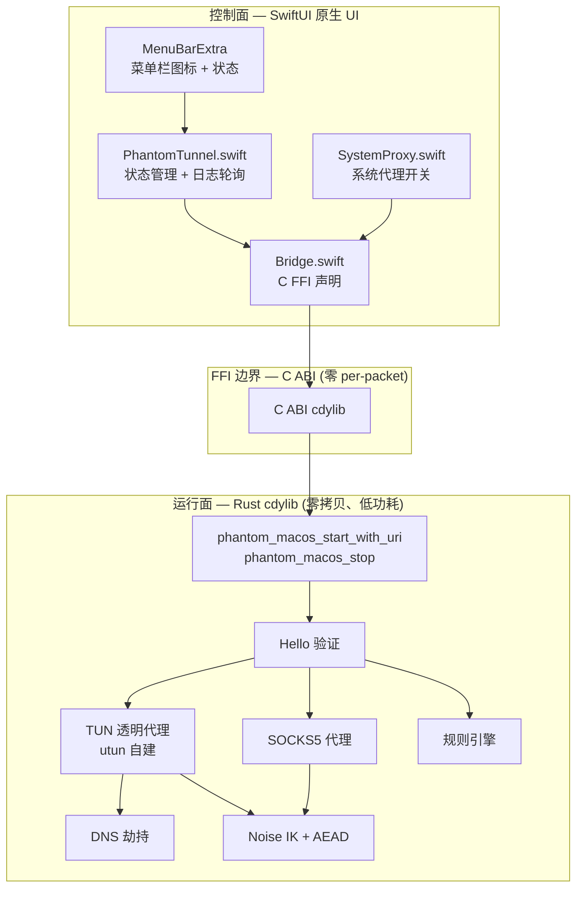
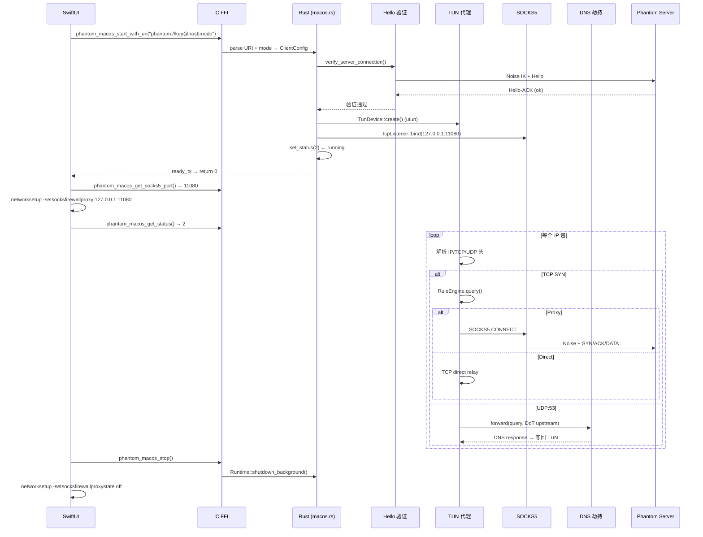
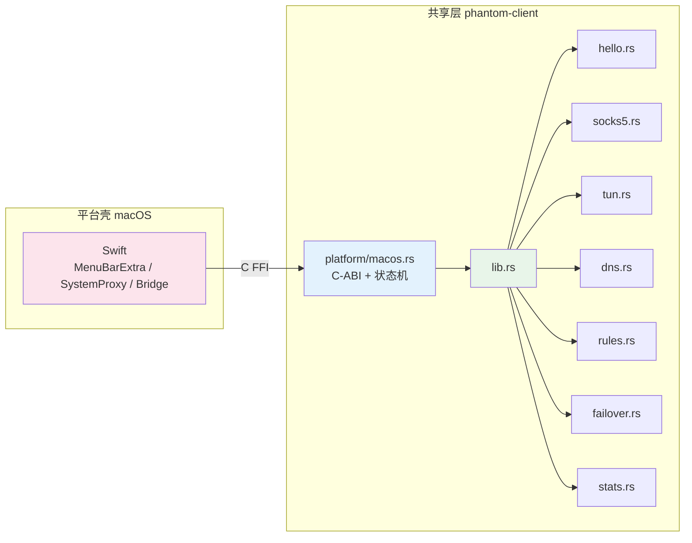

# Phantom macOS Client

Native macOS menu-bar 客户端。隧道引擎全部运行在 Rust cdylib 中，SwiftUI 仅做菜单栏控制壳。

## PRD 功能 → 技术架构映射

| PRD 功能 | 技术模块 | 实现位置 | 关键技术点 |
|----------|----------|----------|------------|
| 菜单栏 VPN | `platform/macos.rs` | `client/src/platform/macos.rs` | C FFI 入口 + 状态机 + 日志缓冲 |
| URI 配置 | `phantom_macos_start_with_uri` | `client/src/platform/macos.rs` | `phantom://key@host:port\|mode` 解析 |
| 系统代理 | `SystemProxy.swift` | `client/mac/Sources/PhantomMac/SystemProxy.swift` | SOCKS5 127.0.0.1:11080 |
| TUN 透明代理 | `tun.rs` | `client/src/tun.rs` | utun 自建设备，无需 Network Extension |
| 智能分流 | `rules.rs` | `client/src/rules.rs` | Smart 模式规则引擎 |
| DNS 防污染 | `dns.rs` | `client/src/dns.rs` | UDP:53 拦截 → DoT 上游 |
| 连接验证 | `hello.rs` | `client/src/hello.rs` | Hello/Hello-ACK 端到端探测 |
| 故障转移 | `failover.rs` | `client/src/failover.rs` | 多服务器 TCP 健康探测 |

## 技术架构：控制面与运行面



### 控制面设计

| 方法 | 方向 | 频率 | 说明 |
|------|------|------|------|
| `phantom_macos_start_with_uri(input, len)` | Swift → Rust | 单次 | 启动隧道 |
| `phantom_macos_stop()` | Swift → Rust | 单次 | 停止隧道 |
| `phantom_macos_get_status()` | Swift ← Rust | 500ms | 0 idle / 1 starting / 2 running / 3 error |
| `phantom_macos_get_last_error()` | Swift ← Rust | 状态 3 时 | 错误信息 (CString, 需 free) |
| `phantom_macos_get_logs(since)` | Swift ← Rust | 1000ms | 日志 + cursor (CString, 需 free) |
| `phantom_macos_get_socks5_port()` | Swift ← Rust | 启动时 | SOCKS5 端口号 |

### 运行面设计（零 per-packet C FFI）

| 技术点 | 实现 |
|--------|------|
| macOS 自建 TUN | `TunDevice::create()` → `tun` crate 创建 utun 设备，无需 Network Extension |
| SOCKS5 + 系统代理 | Rust 开 SOCKS5 → Swift 设 `networksetup -setsocksfirewallproxy` |
| 0 拷贝 | `BytesMut` 池化，`read_buf` → `split().freeze()` |
| 低功耗 | `AsyncFd` 边沿触发，无包时线程阻塞 |
| DNS 缓存 | `DnsCache` 减少 DoT 重复查询 |
| 同步启动反馈 | `ready_tx/ready_rx` 1.5s 超时，Swift `start()` 可同步判断成功/失败 |

## 运行面技术流程



## 共享层与平台壳边界



**关键区别：macOS 自建 TUN**

| 规则 | 说明 |
|------|------|
| macOS 无需 VpnService | Rust `TunDevice::create()` 直接创建 utun 设备 |
| 系统代理由 Swift 管理 | `SystemProxy.swift` 调 `networksetup` 命令设置/取消 SOCKS5 |
| CString 需手动释放 | `phantom_macos_get_logs` / `phantom_macos_get_last_error` 返回的 CString 需调 `phantom_macos_free_logs` 释放 |
| 需要 root 或 entitlement | TUN 创建需 `sudo` 或 `com.apple.vm.networking` entitlement |

## 技术模块与实现位置

| 文件 | 职责 | 关键技术点 |
|------|------|------------|
| `PhantomMacApp.swift` | SwiftUI 入口 + MenuBarExtra + 图标状态 | `MenuBarExtra`、`NSImage` |
| `PhantomTunnel.swift` | 隧道状态管理 + 日志轮询 | 500ms/1000ms Timer |
| `Bridge.swift` | C FFI 声明与封装 | `@_silgen_name` |
| `SystemProxy.swift` | 系统代理开关 | `networksetup -setsocksfirewallproxy` |
| `platform/macos.rs` | C-ABI + 状态机 + 日志缓冲 | `AtomicI32`、`Vec<String>` 环形缓冲、ready channel |
| `tun.rs` | TUN 透明代理 | `tun` crate (utun) / `AsyncFd` (Android/ohos) |
| `socks5.rs` | 本地 SOCKS5 代理 | RFC 1928、连接级加密 |
| `dns.rs` | DNS 劫持 | DoT 上游 |
| `rules.rs` | 规则引擎 | Smart 模式 |
| `hello.rs` | Hello 验证 | 端到端探测 |

## 使用的框架

| 层 | 框架/库 | 版本 | 用途 |
|---|---------|------|------|
| UI | SwiftUI + MenuBarExtra | macOS 13+ | 菜单栏 app |
| 构建系统 | Swift Package Manager | — | 无 Xcode 工程文件 |
| Rust FFI | C ABI cdylib | — | `phantom_client.dylib` |
| Rust 异步 | tokio | workspace | 全功能 runtime |
| Rust TUN | `tun` crate | 0.7 | macOS utun 设备 |
| Rust 加密 | phantom-core crypto | workspace | Noise IK + AES-GCM / ChaCha20-Poly1305 / Ascon128 |

## 构建

### 一键脚本（推荐）

```bash
cd <repo-root>
scripts/build-mac.sh              # 默认 release (Apple Silicon)
scripts/build-mac.sh --debug      # debug 构建
```

脚本会：
1. `cargo build -p phantom-client --lib` → Rust cdylib
2. 复制 dylib → `client/mac/PhantomLibs/`
3. `xcrun swift build -c release` → SPM 编译 Swift
4. `xcrun swift run PhantomMacBuilder` → 打包 `Phantom.app` + `dist/Phantom.dmg`

### 手动分步构建

```bash
# 1. 编译 Rust cdylib
cargo build --release -p phantom-client --lib

# 2. 复制 dylib
mkdir -p client/mac/PhantomLibs
cp target/release/libphantom_client.dylib client/mac/PhantomLibs/

# 3. SPM 编译
cd client/mac
xcrun swift build -c release

# 4. 打包 .app
xcrun swift run -c release PhantomMacBuilder
```

### 跳过打包，直接跑二进制（调试首选）

```bash
cd client/mac
xcrun swift build -c release
./.build/arm64-apple-macosx/release/PhantomMac
```

### 重新生成图标

```bash
cd client/mac
# 覆盖 AppIcon.png (1024×1024) 后：
sips -z 1024 1024 AppIcon.png --out Icon.iconset/icon_512x512@2x.png
# ... 其他尺寸
iconutil -c icns Icon.iconset -o Icon.icns
scripts/build-mac.sh
```

### 前置条件

- Rust toolchain (>= 1.85, edition 2024)
- macOS 13.0+（MenuBarExtra 要求）
- Xcode Command Line Tools（`xcode-select --install`）
- 不需要 Xcode 工程文件：整个构建走 SPM

### 常见问题

| 问题 | 原因 | 修复 |
|------|------|------|
| `permissionDenied` | 沙箱里裸 `swift` 受限 | 改用 `xcrun swift` |
| `dyld: Library not loaded` | 签名缺失 | 重跑 `PhantomMacBuilder` |
| `No image named 'MenuBarIcon'` | SPM asset catalog 问题 | 改用 `NSImage(contentsOf:)` |
| DMG 双击闪退 | Gatekeeper 隔离 | `xattr -dr com.apple.quarantine /Applications/Phantom.app` |

## 打包与签名

- **.app 打包**：`PhantomMacBuilder`（仿 mytime DMGBuilderExec 模式）
- **DMG 打包**：同上，`dist/Phantom.dmg`
- **Ad-hoc 签名**：`codesign --entitlements Phantom.entitlements --force --sign - Phantom.app`
- **开发者签名**：需 Apple Developer ID + `productsign`
- **Entitlements**：`Phantom.entitlements` 包含 `com.apple.vm.networking` (TUN 需要) / `com.apple.security.network.client` / `com.apple.security.network.server`

## 测试

```bash
# Rust 单元测试
cargo test -p phantom-client

# 手动验证
sudo open client/mac/Phantom.app
# 菜单栏出现图标 → 输入 URI → 选模式 → Start
# 验证 Hello 探测成功 → 显示 "Connected"
```

## 安装与部署

```bash
# TUN 需要 root：
sudo open client/mac/Phantom.app

# 或复制到 /Applications
sudo cp -r client/mac/Phantom.app /Applications/
sudo open /Applications/Phantom.app

# 清除 Gatekeeper 隔离
xattr -dr com.apple.quarantine /Applications/Phantom.app
```

## TODO

- [ ] DMG 打包自动化优化
- [ ] Ad-hoc 签名 / 开发者签名
- [ ] 菜单栏交互优化（快捷键、通知）
- [ ] 自动更新检查