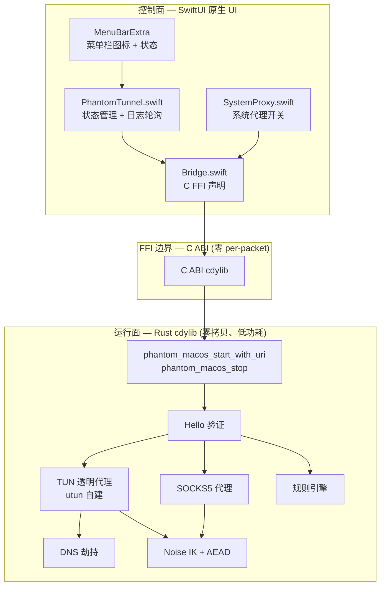
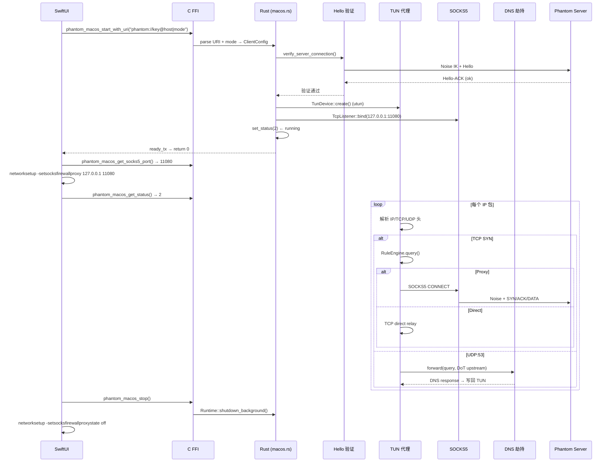
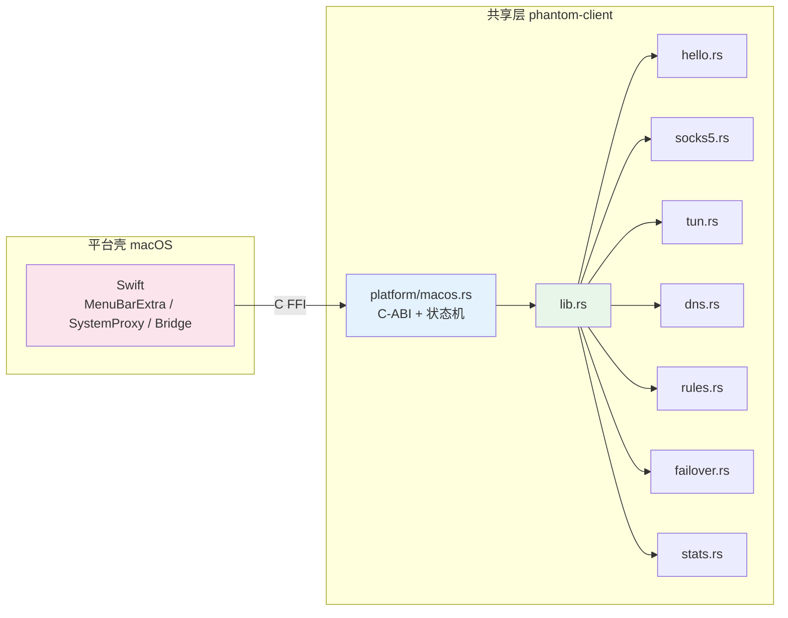

# Phantom macOS Client

Native macOS menu-bar 客户端。隧道引擎全部运行在 Rust cdylib 中，SwiftUI 只做控制面：
**点击菜单栏图标直接展开主面板**（`MenuBarExtra` + `.menuBarExtraStyle(.window)`），
日志在面板内就地放大阅读，不再另开窗口。

## 界面结构

| 区域 | 内容 | 说明 |
|------|------|------|
| 菜单栏图标 | 点击即展开面板；未配置连接时带一个提示圆点 | 模板图，按**轮廓**区分状态（见下） |
| 主面板（弹窗） | 状态头（齿轮 + `⋯`）→ 服务器卡片 → 启动/断开 → 模式 → 连接串摘要 → 日志（占剩余高度）→ 页脚 | 固定 400×620，弹窗不可缩放，所以非日常卡片进二级页 |
| 二级页 | 连接串编辑、连接信息、分流白名单、设置 | 在**同一个弹窗内**推入，左上角「返回」（Esc 同效） |
| 全屏日志 | 同一份日志 + 同一套控件 | 点日志标题旁的「放大」铺满弹窗，不再另开窗口 |

**弹窗内的日志卡下限**是 `Theme.popoverLogMinHeight = 150pt`：弹窗要同时容纳卡片和日志，
低于这个高度就不再压缩日志，改为让卡片区内部滚动。

**为什么二级页不是 sheet**：菜单栏弹窗在失焦时会自行关闭，而被 present 的 sheet 会留在一个
已经消失的宿主窗口上——实测表现为弹窗内容整体变灰、sheet 铺满屏幕、既读不到内容也关不掉
（没有关闭按钮，Esc 也不一定生效）。改成弹窗内推页后只有一个窗口、一条退出路径。

**为什么日志不再单独开窗**：日志窗口需要一整套「找到已存在的 `NSWindow` 并强制前置」的
代码（`openWindow(id:)` 对已存在的窗口是空操作），仍然可能被别的 app 盖住。日志回到弹窗后
这段机制连同窗口一起删掉了。

菜单栏图标是**模板图**（`isTemplate = true`）：macOS 会把菜单栏附加项按单色渲染，
彩色图形会被压成一个看不清的黑块，所以四个状态用**形状**区分，而不是颜色：

| 状态 | 图标 |
|------|------|
| 未连接 | 空心幽灵轮廓 |
| 连接中 | 轮廓 + 中央实心圆点 |
| 已连接 | 实心幽灵 |
| 错误 | 实心幽灵 + 右上角挖空感叹号 |

日志面板只渲染**最近 200 行**（内存保留 1000 行，磁盘日志由 Rust 侧保留），单行不折行、

**行宽是硬约束**（弹窗只有 400pt，日志区约 340pt ≈ 50 个等宽字符），所以一行里的每个部分
都要为「让路由结论留在屏幕上」让路：

- 核心侧用 `.without_time()` 关掉默认的 RFC3339 时间戳（原来约 33 列，占掉三分之一行宽），
  改由 Swift 在收行时加**固定 9 列**的本地 `HH:MM:SS`。附带好处：时间戳不再每条唯一，
  「连续重复折叠成 `×N`」才能真正命中。
- 渲染时把 `INFO/WARN/ERROR` 这 5 列**从文本里摘出来**，改成 `LogLine.level` 字段供着色
  （颜色已经表达了严重级别；`ERROR` 红、`WARN` 橙、直连灰、其余主色）。
- 折叠多余空格（`tracing` 会按等级列补空格），字号 10.5pt 等宽、行间距 0、
  面板内边距收到 8/4，卡片内边距 10、横向 12。

结果：`17:26:44 route www.google.com:443 -> Proxy (whitelist)`（54 列）能完整显示在一行内。
等宽字体、连续重复折叠成 `×N`；`仅隧道 / 全部` 切换用来隐藏直连记录。

`仅隧道` 认定的直连记录 = 核心统一写出的 `route <目标> -> Direct (原因)`（TUN 与
SOCKS5/HTTP 三条路径共用 `whitelist::route_log_line`，拼写一致），以及
SOCKS5/HTTP 路径的 `Direct connection established` / `Direct HTTP …` 逐流日志。
macOS 走的是系统 SOCKS5/HTTP 代理而非 TUN，早期只有 SOCKS5 侧写成大写
`-> DIRECT (`，过滤规则只认 TUN 的小写拼写，于是「仅隧道」几乎什么都没滤掉。
现在大小写都匹配；另外 `SOCKS5 target: …`、`HTTP CONNECT → …` 这类**先于判定**
打印的行，会按紧随其后的判定结果决定去留（该目标走直连则一并隐藏）。

## PRD 功能 → 技术架构映射

| PRD 功能 | 技术模块 | 实现位置 | 关键技术点 |
|----------|----------|----------|------------|
| 菜单栏 VPN | `platform/macos.rs` | `client/src/platform/macos.rs` | C FFI 入口 + 状态机 + 日志缓冲 |
| URI 配置 | `phantom_macos_start_with_uri` | `client/src/platform/macos.rs` | `phantom://key@host:port\|mode` 解析 |
| 系统代理 | `SystemProxy.swift` | `client/mac/Sources/PhantomMac/SystemProxy.swift` | SOCKS5 127.0.0.1:11080 |
| TUN 透明代理 | `tun.rs` | `client/src/tun.rs` | utun 自建设备，无需 Network Extension |
| 智能分流 | `rules.rs` | `client/src/rules.rs` | Smart 模式规则引擎 |
| DNS 防污染 | `dns.rs` | `client/src/dns.rs` | UDP:53 拦截 → DoT 上游 |
| 连接验证 | `hello.rs` | `client/src/hello.rs` | Hello/Hello-ACK 端到端探测 |
| 故障转移 | `failover.rs` | `client/src/failover.rs` | 多服务器 TCP 健康探测 |

## 技术架构：控制面与运行面


```mermaid
graph TB
    subgraph "控制面 — SwiftUI 原生 UI"
        MenuBar["MenuBarExtra<br/>菜单栏图标 + 状态"]
        Tunnel["PhantomTunnel.swift<br/>状态管理 + 日志轮询"]
        Proxy["SystemProxy.swift<br/>系统代理开关"]
        Bridge["Bridge.swift<br/>C FFI 声明"]
    end

    subgraph "FFI 边界 — C ABI (零 per-packet)"
        CFFI["C ABI cdylib"]
    end

    subgraph "运行面 — Rust cdylib (零拷贝、低功耗)"
        MacStart["phantom_macos_start_with_uri<br/>phantom_macos_stop"]
        Hello["Hello 验证"]
        TUN["TUN 透明代理<br/>utun 自建"]
        S5["SOCKS5 代理"]
        DNS["DNS 劫持"]
        Rules["规则引擎"]
        Crypto["Noise IK + AEAD"]
    end

    MenuBar --> Tunnel
    Tunnel --> Bridge
    Bridge --> CFFI
    Proxy --> Bridge
    CFFI --> MacStart
    MacStart --> Hello
    Hello --> Rules & TUN & S5
    TUN --> DNS & Crypto
    S5 --> Crypto
```

### 控制面设计

| 方法 | 方向 | 频率 | 说明 |
|------|------|------|------|
| `phantom_macos_start_with_uri(input, len)` | Swift → Rust | 单次 | 启动隧道 |
| `phantom_macos_stop()` | Swift → Rust | 单次 | 停止隧道 |
| `phantom_macos_get_status()` | Swift ← Rust | 500ms | 0 idle / 1 starting / 2 running / 3 error |
| `phantom_macos_get_last_error()` | Swift ← Rust | 状态 3 时 | 错误信息 (CString, 需 free) |
| `phantom_macos_get_logs(since)` | Swift ← Rust | 1000ms | 日志 + cursor (CString, 需 free) |
| `phantom_macos_get_socks5_port()` | Swift ← Rust | 启动时 | SOCKS5 端口号 |

### 运行面设计（零 per-packet C FFI）

| 技术点 | 实现 |
|--------|------|
| macOS 自建 TUN | `TunDevice::create()` → `tun` crate 创建 utun 设备，无需 Network Extension |
| SOCKS5 + 系统代理 | Rust 开 SOCKS5 → Swift 设 `networksetup -setsocksfirewallproxy` |
| 0 拷贝 | `BytesMut` 池化，`read_buf` → `split().freeze()` |
| 低功耗 | `AsyncFd` 边沿触发，无包时线程阻塞 |
| DNS 缓存 | `DnsCache` 减少 DoT 重复查询 |
| 同步启动反馈 | `ready_tx/ready_rx` 1.5s 超时，Swift `start()` 可同步判断成功/失败 |

## 运行面技术流程


```mermaid
sequenceDiagram
    participant S as SwiftUI
    participant F as C FFI
    participant R as Rust (macos.rs)
    participant H as Hello 验证
    participant T as TUN 代理
    participant P as SOCKS5
    participant D as DNS 劫持
    participant Srv as Phantom Server

    S->>F: phantom_macos_start_with_uri("phantom://key@host|mode")
    F->>R: parse URI + mode → ClientConfig
    R->>H: verify_server_connection()
    H->>Srv: Noise IK + Hello
    Srv-->>H: Hello-ACK (ok)
    H-->>R: 验证通过

    R->>T: TunDevice::create() (utun)
    R->>P: TcpListener::bind(127.0.0.1:11080)
    R->>R: set_status(2) ← running
    R-->>S: ready_tx → return 0

    S->>F: phantom_macos_get_socks5_port() → 11080
    S->>S: networksetup -setsocksfirewallproxy 127.0.0.1 11080

    S->>F: phantom_macos_get_status() → 2

    loop 每个 IP 包
        T->>T: 解析 IP/TCP/UDP 头
        alt TCP SYN
            T->>T: RuleEngine.query()
            alt Proxy
                T->>P: SOCKS5 CONNECT
                P->>Srv: Noise + SYN/ACK/DATA
            else Direct
                T->>T: TCP direct relay
            end
        else UDP:53
            T->>D: forward(query, DoT upstream)
            D-->>T: DNS response → 写回 TUN
        end
    end

    S->>F: phantom_macos_stop()
    F->>R: Runtime::shutdown_background()
    S->>S: networksetup -setsocksfirewallproxystate off
```

## 共享层与平台壳边界


```mermaid
graph LR
    subgraph "共享层 phantom-client"
        lib["lib.rs"]
        hello["hello.rs"]
        socks5["socks5.rs"]
        tun["tun.rs"]
        dns["dns.rs"]
        rules["rules.rs"]
        failover["failover.rs"]
        stats["stats.rs"]
        macos_mod["platform/macos.rs<br/>C-ABI + 状态机"]
    end

    subgraph "平台壳 macOS"
        swift["Swift<br/>MenuBarExtra / SystemProxy / Bridge"]
    end

    macos_mod --> lib
    lib --> hello & socks5 & tun & dns & rules & failover & stats
    swift -->|C FFI| macos_mod

    style lib fill:#e8f5e9
    style macos_mod fill:#e3f2fd
    style swift fill:#fce4ec
```

**关键区别：macOS 自建 TUN**

| 规则 | 说明 |
|------|------|
| macOS 无需 VpnService | Rust `TunDevice::create()` 直接创建 utun 设备 |
| 系统代理由 Swift 管理 | `SystemProxy.swift` 调 `networksetup` 命令设置/取消 SOCKS5 |
| CString 需手动释放 | `phantom_macos_get_logs` / `phantom_macos_get_last_error` 返回的 CString 需调 `phantom_macos_free_logs` 释放 |
| 需要 root 或 entitlement | TUN 创建需 `sudo` 或 `com.apple.vm.networking` entitlement |

## 技术模块与实现位置

| 文件 | 职责 | 关键技术点 |
|------|------|------------|
| `PhantomMacApp.swift` | SwiftUI 入口 + MenuBarExtra 弹窗 + 退出钩子 | `MenuBarExtra(.window)`、`NSApplicationDelegate` |
| `MainWindowView.swift` | 弹窗布局与二级页（连接串/详情/白名单/设置） | 高度测量 + 日志卡自适应 + 页内导航 |
| `LogViews.swift` | 日志卡与全屏日志 | 过滤 / 暂停 / 清空 / 单行不折行 |
| `InfoPanel.swift` | 连接信息与探针入口 | `TrafficRates`、`TunnelProbe` |
| `ConnectionCard.swift` | 连接串输入、历史、分享二维码 | `QRCode`（CoreImage） |
| `WhitelistEditor.swift` | 分流白名单列表编辑 | 逐条校验 + 批量导入 |
| `PhantomTunnel.swift` | 隧道状态管理 + 日志/统计轮询 | 200ms 状态、500ms 日志、1s 统计 |
| `Bridge.swift` | C FFI 声明与封装 | `@_silgen_name` |
| `SystemProxy.swift` | 系统代理开关 | `networksetup -setsocksfirewallproxy` |
| `PhantomMacKit/` | 纯逻辑库（可单测，无 UI 状态） | URI 解析、日志视图、白名单校验、SOCKS5 探针、菜单栏图标 |
| `platform/macos.rs` | C-ABI + 状态机 + 日志缓冲 | `AtomicI32`、`Vec<String>` 环形缓冲、ready channel |
| `tun.rs` | TUN 透明代理 | `tun` crate (utun) / `AsyncFd` (Android/ohos) |
| `socks5.rs` | 本地 SOCKS5 代理 | RFC 1928、连接级加密 |
| `dns.rs` | DNS 劫持 | DoT 上游 |
| `rules.rs` | 规则引擎 | Smart 模式 |
| `whitelist.rs` | 代理白名单（默认直连） | 内置被墙域名 FST + 用户条目 |
| `hello.rs` | Hello 验证 | 端到端探测 |

## 使用的框架

| 层 | 框架/库 | 版本 | 用途 |
|---|---------|------|------|
| UI | SwiftUI + MenuBarExtra | macOS 13+ | 菜单栏 app |
| 构建系统 | Swift Package Manager | — | 无 Xcode 工程文件 |
| Rust FFI | C ABI cdylib | — | `phantom_client.dylib` |
| Rust 异步 | tokio | workspace | 全功能 runtime |
| Rust TUN | `tun` crate | 0.7 | macOS utun 设备 |
| Rust 加密 | phantom-core crypto | workspace | Noise IK + AES-GCM / ChaCha20-Poly1305 / Ascon128 |

## 构建

### 统一构建系统（推荐）

```bash
# 从项目根目录
cargo xtask build mac           # release 构建
cargo xtask build mac --debug   # debug 构建
```

`cargo xtask` 会自动检查依赖、调用 `scripts/build-mac.sh` 脚本。

### 一键脚本

```bash
cd <repo-root>
scripts/build-mac.sh              # 默认 release (Apple Silicon)
scripts/build-mac.sh --debug      # debug 构建
scripts/build-mac.sh --install    # 额外装到 /Applications 并刷新图标缓存
```

脚本会：
1. `cargo build -p phantom-client --lib` → Rust cdylib
2. 复制 dylib → `client/mac/.build/lib/`
3. `xcrun swift build -c release` → SPM 编译 Swift
4. `xcrun swift run PhantomMacBuilder` → 打包 `Phantom.app` + `dist/Phantom.dmg`
5. `xcrun swift test` → 跑 `PhantomMacKit` 的纯逻辑测试（图标、过滤、校验、协议编解码）

`--install` 会把产物复制到 `/Applications/Phantom.app`，`touch` 一次并调用
`lsregister -f` 刷新 LaunchServices 的图标缓存 —— 换过 `appicon.png` 之后 Finder
仍显示旧图标，就是这层缓存造成的（必要时 `killall Dock`）。

### 构建产物

所有构建产物统一存放在 `client/mac/.build/` 目录下：

```
client/mac/.build/
├── icon/                    # 应用图标
│   ├── Icon.iconset/        # macOS 图标集
│   └── Icon.icns            # 编译后 .icns
├── lib/                     # Rust cdylib
│   └── libphantom_client.dylib
├── Phantom.app/             # macOS 应用包
├── dist/                    # 分发产物
│   └── Phantom.dmg          # DMG 安装镜像
└── arm64-apple-macosx/      # SPM 构建缓存
```

### 手动分步构建

```bash
# 1. 编译 Rust cdylib
cargo build --release -p phantom-client --lib

# 2. 复制 dylib
mkdir -p client/mac/.build/lib
cp target/release/libphantom_client.dylib client/mac/.build/lib/

# 3. SPM 编译
cd client/mac
xcrun swift build -c release

# 4. 打包 .app + .dmg
xcrun swift run -c release PhantomMacBuilder
```

### 跳过打包，直接跑二进制（调试首选）

```bash
cd client/mac
xcrun swift build -c release
./.build/arm64-apple-macosx/release/PhantomMac
```

### 重新生成图标

```bash
# 方式一：统一构建系统（推荐）
cargo xtask icons              # 生成所有平台图标

# 方式二：手动 sips
# 覆盖 appicon.png (1024×1024) 后：
cd client/mac
sips -z 1024 1024 ../../appicon.png --out .build/icon/Icon.iconset/icon_512x512@2x.png
# ... 其他尺寸
iconutil -c icns .build/icon/Icon.iconset -o .build/icon/Icon.icns
scripts/build-mac.sh
```

### 前置条件

- Rust toolchain (>= 1.85, edition 2024)
- macOS 13.0+（MenuBarExtra 要求）
- Xcode Command Line Tools（`xcode-select --install`）
- 不需要 Xcode 工程文件：整个构建走 SPM

### 常见问题

| 问题 | 原因 | 修复 |
|------|------|------|
| `permissionDenied` | 沙箱里裸 `swift` 受限 | 改用 `xcrun swift` |
| `dyld: Library not loaded` | 签名缺失 | 重跑 `PhantomMacBuilder` |
| 菜单栏只有黑块 / 看不出状态 | 用彩色 `Shape` 当菜单栏图标，被模板渲染抹平 | 图标已改为 `MenuBarGlyph` 绘制的模板图，按形状区分状态 |
| Finder 里还是旧图标 | LaunchServices 图标缓存 | `scripts/build-mac.sh --install` 或 `lsregister -f` 后 `killall Dock` |
| 主窗口图标是旧彩色插图 | 曾硬编码 `MenuBarIcon.png` | 已改用 `NSApplication.shared.applicationIconImage`（即 `AppIcon.icns`） |
| DMG 双击闪退 | Gatekeeper 隔离 | `xattr -dr com.apple.quarantine /Applications/Phantom.app` |

## 打包与签名

- **.app 打包**：`PhantomMacBuilder`（SPM executable target，自动组装 .app bundle）
- **DMG 打包**：同上，`.build/dist/Phantom.dmg`
- **Ad-hoc 签名**：`codesign --entitlements Phantom.entitlements --force --sign - Phantom.app`
- **开发者签名**：需 Apple Developer ID + `productsign`
- **Entitlements**：`Phantom.entitlements` 包含 `com.apple.vm.networking` (TUN 需要) / `com.apple.security.network.client` / `com.apple.security.network.server`

## 测试

```bash
# Rust 单元测试
cargo test -p phantom-client --lib

# Swift 纯逻辑测试（图标渲染 / 日志过滤 / 白名单校验 / SOCKS5 探针编解码）
cd client/mac && xcrun swift test

# 导出四种菜单栏状态 PNG 做人工确认（可选）
PHANTOM_GLYPH_DUMP=/tmp/phantom-glyph xcrun swift test --filter MenuBarGlyphTests

# 手动验证
# 正常模式（推荐，与 ClashX / SpeedCat 等一致：普通用户运行，无需 sudo）
open client/mac/.build/Phantom.app
# 菜单栏出现幽灵图标 → 「打开主界面」→ 输入 URI → 选模式 → 启动
# 验证 Hello 探测成功 → 显示 "Connected"，系统 SOCKS5 自动指向 127.0.0.1:11080
# Stop 时自动还原（networksetup 以当前用户身份执行，无需授权弹窗）
# 退出（底部按钮 / ⋯ 菜单 / ⌘Q）都会先断开隧道并还原系统代理
```

## 安装与部署

```bash
# TUN 需要 root：
# 普通模式（SOCKS5 + 系统代理）：普通用户即可
open client/mac/.build/Phantom.app

# 或复制到 /Applications
sudo cp -r client/mac/.build/Phantom.app /Applications/
open /Applications/Phantom.app

# 需要 TUN 透明代理时才用 root 启动可执行文件
sudo /Applications/Phantom.app/Contents/MacOS/Phantom

# 清除 Gatekeeper 隔离
xattr -dr com.apple.quarantine /Applications/Phantom.app

# 或通过 DMG 安装
open client/mac/.build/dist/Phantom.dmg
# 然后 drag Phantom.app into /Applications
```

## 项目目录结构

```
client/mac/
├── .build/                          # 构建产物（gitignore）
│   ├── icon/                        # 应用图标
│   │   ├── Icon.iconset/            # macOS 图标集（10 个尺寸）
│   │   └── Icon.icns                # .icns 图标文件
│   ├── lib/                         # Rust cdylib
│   │   └── libphantom_client.dylib
│   ├── Phantom.app/                 # 打包后的应用
│   └── dist/                        # 分发产物
│       └── Phantom.dmg
├── Sources/
│   ├── PhantomMac/                  # SwiftUI 主程序
│   │   ├── PhantomMacApp.swift      # 入口 + MenuBarExtra
│   │   ├── PhantomTunnel.swift      # 隧道状态管理
│   │   ├── Bridge.swift             # C FFI 声明
│   │   └── SystemProxy.swift        # 系统代理开关
│   └── PhantomMacBuilder/           # .app/.dmg 打包工具
│       └── main.swift
├── Package.swift                     # SPM 配置
├── Info.plist                        # .plist 模板
├── Phantom.entitlements             # 权限声明
└── README.md
```

## TODO

- [ ] DMG 打包自动化优化
- [ ] Ad-hoc 签名 / 开发者签名
- [ ] 连接状态通知（菜单栏图标之外的系统提示）
- [ ] 测延迟 / 测速的历史曲线
- [ ] 自动更新检查
