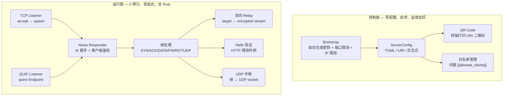
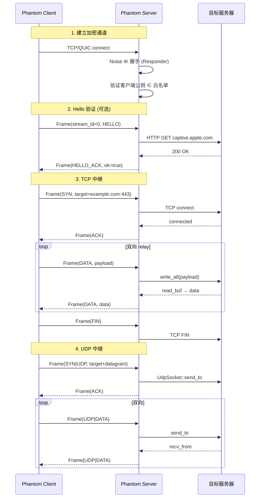

# Phantom Server

Phantom 服务端是轻量级加密代理中继，接收客户端 Noise IK 加密连接，将流量透明转发到目标地址。

## PRD 功能 → 技术架构映射

| PRD 功能 | 技术模块 | 实现位置 | 关键技术点 |
|----------|----------|----------|------------|
| 加密监听 | `lib.rs` → `run_tcp` / `run_quic` | `server/src/lib.rs` | Noise Responder 握手、客户端白名单 |
| 连接处理 | `handler.rs` | `server/src/handler.rs` | SYN/ACK/DATA/FIN/RST 帧协议、双向 relay |
| Hello 验证 | `handler.rs::handle_hello` | `server/src/handler.rs` | HTTP 探测外网、Hello-ACK 回传 |
| UDP 中继 | `handler.rs::udp_relay` | `server/src/handler.rs` | UDP SYN 解码、双向帧↔UDP 数据报 |
| QUIC 多路复用 | `handler.rs::handle_quic_connection` | `server/src/handler.rs` | 首流 Noise 握手、后续流 HKDF 派生 |
| 零配置自举 | `bootstrap.rs` | `server/src/bootstrap.rs` | 自动生成密钥、探测端口、探测出口 IP、QR 码 |
| io_uring | `linux_ext.rs` | `server/src/linux_ext.rs` | Linux-only，零拷贝 accept |
| 密钥管理 | `phantom-core config` | `core/src/config.rs` | X25519 密钥对加载/生成、白名单内联 |

## 技术架构：控制面与运行面



### 控制面设计原则

| 原则 | 实践 |
|------|------|
| **零配置** | `phantom server` 一键启动：自动生成密钥、探测端口、探测 IP |
| **运维友好** | `server.toml` 头部带 `phantom://` URI 注释 + QR 码，终端即可分发 |
| **安全默认** | 白名单内联在 TOML 中，空 = OPEN 模式，非空 = 只接受白名单客户端 |

### 运行面设计原则

| 原则 | 实践 |
|------|------|
| **0 拷贝 / 少拷贝** | relay 用 `BytesMut::read_buf` → `split().freeze()`；io_uring 零拷贝 accept |
| **低延迟** | 每连接独立 tokio task，无全局锁；QUIC 多路复用减少握手 |
| **全 Rust** | Noise + AEAD + 帧 + relay 全部 Rust 实现，无 C 依赖 |

## 运行面技术流程



## 技术模块详解

### lib.rs — 服务端入口与调度

| 技术点 | 实现 |
|--------|------|
| 三种入口 | `run(config_path)` / `run_with_options(opts)` / `run_from_uri(uri, key_path)` |
| 协议分发 | `TransportProtocol::Tcp` → `run_tcp`；`TransportProtocol::Quic` → `run_quic` |
| 优雅关闭 | `tokio::signal::ctrl_c()` + `tokio::select!` |
| 每连接独立 | `tokio::spawn` 处理每个连接 |

### handler.rs — 连接处理核心

| 技术点 | 实现 |
|--------|------|
| Noise 握手 | `NoiseResponder::new(&secret_key).handshake(stream, &supported)` |
| 客户端鉴权 | `allowed_clients.contains(&result.remote_static_key)` |
| Hello 处理 | `handle_hello()` → HTTP 探测 → Hello-ACK |
| TCP relay | `relay()` — `tokio::try_join!(to_tunnel, from_tunnel)` |
| UDP relay | `udp_relay()` — UDP socket + 帧↔数据报转换 |
| QUIC 多路复用 | `handle_quic_connection()` — 首流 Noise，后续 HKDF |
| 帧解码 | `decode_udp_syn()` — atyp + addr + port + datagram |

### bootstrap.rs — 零配置自举

| 技术点 | 实现 |
|--------|------|
| 自动模式 | `run_auto()` — 自动生成密钥、探测端口、探测 IP、写 server.toml |
| 交互模式 | `run_interactive()` — TTY 向导（端口 / IP / 加密 / 协议） |
| URI 自举 | `run_from_uri()` — 验证 URI 公钥匹配本地密钥 |
| 端口探测 | `try_bind_tcp_with_fallback` / `try_bind_quic_with_fallback` |
| IP 探测 | `detect_outbound_ip()` — UDP socket trick，无发包 |
| QR 码 | `qr2term::print_qr()` — 终端 Unicode QR |
| TOML 生成 | `write_server_toml()` — URI 注释 + bind + cipher + 白名单 |

### linux_ext.rs — Linux 高性能扩展

| 技术点 | 实现 |
|--------|------|
| io_uring | `run_uring_server()` — 零拷贝 accept (feature `io-uring`) |
| SO_REUSEPORT | `bind()` — 多进程负载均衡 |

## 使用的技术框架

| 领域 | 框架 / 库 | 版本 | 用途 |
|------|-----------|------|------|
| 异步运行时 | tokio | workspace | 多线程 runtime |
| 加密 | phantom-core crypto | workspace | Noise IK Responder + AEAD |
| 传输 | phantom-core transport | workspace | TCP / QUIC (quinn) 监听 |
| 协议 | phantom-core protocol | workspace | Frame codec |
| 配置 | toml / serde | workspace | ServerConfig TOML 反序列化 |
| QR 码 | qr2term | — | 终端 Unicode QR |
| Base64 | base64 | workspace | 密钥编码 |
| io_uring | io-uring (feature) | — | Linux 零拷贝 |
| 日志 | tracing / tracing-subscriber | workspace | 结构化日志 |

## 构建

### 统一构建系统（推荐）

```bash
# 从项目根目录
cargo xtask build server          # release 构建
cargo xtask build server --debug  # debug 构建
```

### 传统方式

```bash
# Release
cargo build --release -p phantom-server

# Debug
cargo build -p phantom-server

# 带 io_uring (仅 Linux)
cargo build --release -p phantom-server --features io-uring
```

## 测试

```bash
# 单元测试
cargo test -p phantom-server

# 集成测试（需要两个终端）
# 终端 1：启动服务端
cargo run --release -p phantom-server -- --port 4433

# 终端 2：运行客户端 + 全链路测试
cargo test --workspace --test full_link_tcp
cargo test --workspace --test correctness
```

## 安装

### 一键安装 (Linux)

```bash
sudo bash deploy/install.sh
```

脚本会：
1. `cargo build --release -p phantom-server`
2. 复制二进制到 `/usr/local/bin/phantom-server`
3. 创建系统用户 `phantom`
4. 安装 systemd unit 到 `/etc/systemd/system/phantom.service`

### 手动安装

```bash
cargo build --release -p phantom-server
sudo cp target/release/phantom-server /usr/local/bin/
```

## 部署

### 零配置自举（推荐）

```bash
sudo systemctl start phantom
sudo journalctl -u phantom -f
```

首次启动自动：生成密钥 → 探测端口 → 探测 IP → 写 server.toml → 打印 URI + QR。

### TOML 配置模式

```bash
phantom-server /path/to/server.toml
```

### systemd 管理

```bash
sudo systemctl start phantom    # 启动
sudo systemctl status phantom   # 状态
sudo systemctl restart phantom  # 重启
sudo journalctl -u phantom -f   # 日志
```

详细部署指南见 [deploy/README.md](../deploy/README.md)。

## 签名

服务端是纯 Linux 二进制，无需代码签名。密钥安全：
- `server.key` 权限 600，owner `phantom`
- 不要分发私钥，只分发 `phantom://` URI（含公钥）